# Loja das Comunidades Tech BR — Modelo de Negócios

> Documento para discussão com as comunidades de tecnologia do Brasil (piloto: comunidade PHP Brasil).
> Versão 0.4 — 25/09/2026 — **rascunho aberto a contribuições**
> *"Loja das Comunidades Tech BR" é nome provisório.*

**Mudanças da v0.4**
- Três novas regras de negócio **propostas para discussão** (marcadas 🔶, não decididas): RN42 (reserva de tiragem limitada para evitar overselling), RN43 (encerramento/saída de comunidade) e RN44 (retenção/exclusão de dados pessoais, LGPD). Novas linhas Q20 e Q21 em §14 registram os riscos que motivaram as propostas.

**Mudanças da v0.3**
- Biblioteca de UI definida: **DaisyUI**, usando a skill `npx -y skills add saadeghi/daisyui` (§12).
- Monetização da plataforma: **R$ 2,49 por saque** solicitado por comunidade ou fornecedor (§6, RN24c, §9.9).
- Parcelamento: por padrão a taxa do parcelado é **repassada ao cliente**; a comunidade pode optar por assumir (sem juros) (§6, RN21).
- Taxa % do cartão pode ser **absorvida pelo fornecedor** mediante acordo com a comunidade (§6, RN22).
- Destaque para o cliente de **quanto a comunidade recebe a mais no Pix** (RN24).
- Decidido: parcelado repassado = **taxa inteira** ao cliente (RN21); mascote genérico da linguagem sempre em análise humana (RN33a).
- Nova **análise de originalidade (anti-plágio)** com avaliação humana antes de publicar produtos (RN32–RN41, §8.9–8.10, §9.8, §10.2).

**Mudanças da v0.2**
- Escopo ampliado: de loja do PHP Brasil para **loja oficial das comunidades de tecnologia do Brasil** (qualquer stack).
- Nova funcionalidade: cliente pode **acompanhar comunidades** e receber e-mail a cada lançamento (§5, §8.7–8.8, §9.6–9.7).
- **Tabela real de taxas do gateway** e split recalculado por forma de pagamento (§6).

---

## Resumo em 1 minuto

**Em uma frase:** a comunidade monta a loja, o fornecedor produz e entrega, o cliente compra, e o pagamento é dividido automaticamente entre todos. A comunidade **não compra estoque e não envia nada**: é o modelo de **dropshipping**.

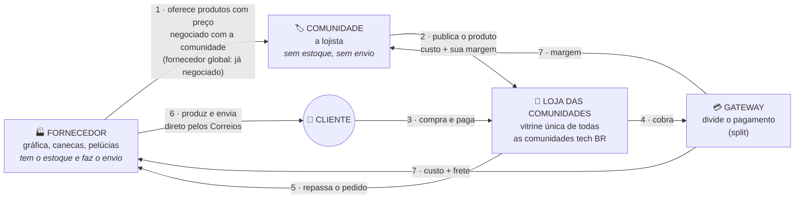

| Quem | O que faz | O que ganha |
|---|---|---|
| 🏷️ **Comunidade** | Escolhe o fornecedor, cria o produto (camisa, caneca, mascote, item de evento) e define a margem | A **margem** de cada venda, para financiar meetups e eventos |
| 🏭 **Fornecedor** | Oferece o produto pelo preço negociado com a comunidade que o cadastra (no fornecedor global da plataforma, esse preço já vem negociado). Produz, embala e envia **direto ao cliente**, informando o rastreio | O **custo do produto + frete** |
| 🙋 **Cliente** | Compra de várias comunidades num só carrinho e acompanha as que gosta | Produto oficial e a certeza de que ajuda a comunidade |
| 🛒 **Plataforma** | Mantém a loja, aprova comunidades e analisa se o produto é original | **R$ 2,49 por saque** de comunidade ou fornecedor (nada sobre as vendas) |

**Por que dropshipping?** Na loja tradicional, a comunidade compra 100 camisas, guarda em casa, embala e posta, e fica com o prejuízo do que sobrar. Aqui, a camisa só é produzida **depois que alguém paga**, e sai do fornecedor direto para o cliente. Risco zero de estoque para a comunidade.

---

## Sumário

0. [Resumo em 1 minuto](#resumo-em-1-minuto)
1. [Visão geral](#1-visão-geral)
2. [Problema e proposta de valor](#2-problema-e-proposta-de-valor)
3. [Envolvidos (atores)](#3-envolvidos-atores)
4. [Business Model Canvas](#4-business-model-canvas)
5. [Acompanhar comunidades](#5-acompanhar-comunidades)
6. [Como o dinheiro circula (split)](#6-como-o-dinheiro-circula-split)
7. [Regras de negócio](#7-regras-de-negócio)
8. [Diagramas de fluxo](#8-diagramas-de-fluxo)
9. [Diagramas de sequência](#9-diagramas-de-sequência)
10. [Ciclos de vida (pedido e produto)](#10-ciclos-de-vida)
11. [Modelo de dados (conceitual)](#11-modelo-de-dados-conceitual)
12. [Telas envolvidas](#12-telas-envolvidas)
13. [Mapa de navegação](#13-mapa-de-navegação)
14. [Riscos e pontos em aberto](#14-riscos-e-pontos-em-aberto)
15. [Roadmap sugerido](#15-roadmap-sugerido)

---

## 1. Visão geral

A **Loja das Comunidades Tech BR** é a **loja oficial das comunidades de tecnologia do Brasil**: um marketplace nichado onde **as comunidades são as lojistas**. PHP, Python, JavaScript, Java, Go, Ruby, .NET, dados, DevOps, grupos de mulheres na tecnologia, comunidades regionais: qualquer comunidade aprovada pode vender. Em um só lugar, qualquer pessoa encontra:

- 👕 Camisas oficiais das comunidades
- ☕ Canecas
- 🧸 Os **mascotes caracterizados** de cada comunidade (ex.: o elePHPant da comunidade PHP)
- 🎟️ Itens **exclusivos de cada edição de evento** (ex.: PHPeste e outros eventos das comunidades)

Cada comunidade cadastra seus produtos, escolhe fornecedores, define sua margem e tem **financeiro próprio**, e pode usar o que arrecadar para **financiar suas operações e eventos**: meetups, bolsas, infraestrutura etc.

O cliente pode **acompanhar** as comunidades de que gosta e recebe um e-mail sempre que alguma delas lança algo novo.

A comunidade **PHP Brasil** é a comunidade piloto. Os exemplos deste documento usam comunidades PHP, mas as regras valem para qualquer comunidade.

A operação segue um modelo **parecido com dropshipping**:

- a comunidade **não mantém estoque** e não faz envios;
- o **fornecedor** produz ou separa o item e envia direto ao cliente;
- o pagamento é dividido automaticamente (**split**) entre **gateway**, **comunidade** e **fornecedor**;
- o frete é calculado pela **API dos Correios**.

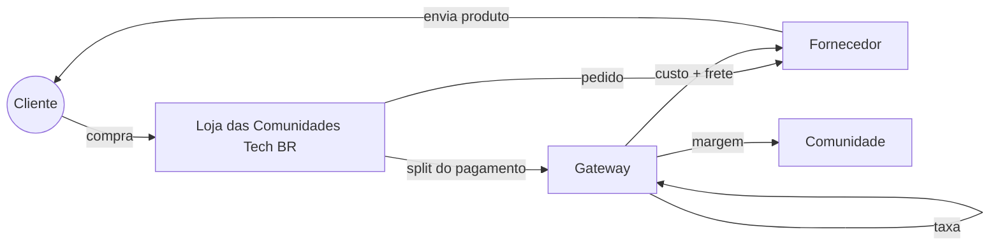

---

## 2. Problema e proposta de valor

### Problemas atuais

| Problema | Impacto |
|---|---|
| Produtos de cada comunidade ficam espalhados (formulários, DMs, pix manual, vendas só em eventos) | Difícil de achar e de comprar |
| Comunidade precisa comprar estoque antes de vender | Risco financeiro e dinheiro parado |
| Voluntários cuidam de embalar, enviar e cobrar | Trabalho operacional e desgaste |
| Pouca transparência sobre o destino do dinheiro | Menos confiança de quem compra |
| Itens de edição de evento (ex.: PHPeste) só vendidos no local | Quem não foi fica sem o item |
| Fã de uma comunidade não fica sabendo quando sai produto novo | Venda perdida; lançamento depende de post em rede social |
| Cada comunidade reinventa a própria loja | Esforço repetido em todo o ecossistema |

### Proposta de valor por ator

| Ator | Valor entregue |
|---|---|
| **Cliente / membro da comunidade** | Um lugar único e confiável, preços acessíveis, frete calculado na hora, rastreio, a certeza de que apoia a comunidade e aviso de lançamentos das comunidades que acompanha |
| **Comunidade (lojista)** | Loja pronta sem estoque, sem operação logística, recebimento automático, financeiro separado para investir em eventos e público de seguidores avisado a cada lançamento |
| **Fornecedor** | Canal de vendas recorrente com várias comunidades, pedidos organizados em painel próprio, recebimento automático no split |
| **Ecossistema tech BR** | Fortalece a marca das comunidades, financia eventos, aumenta a visibilidade dos meetups e aproxima comunidades de stacks diferentes |

---

## 3. Envolvidos (atores)

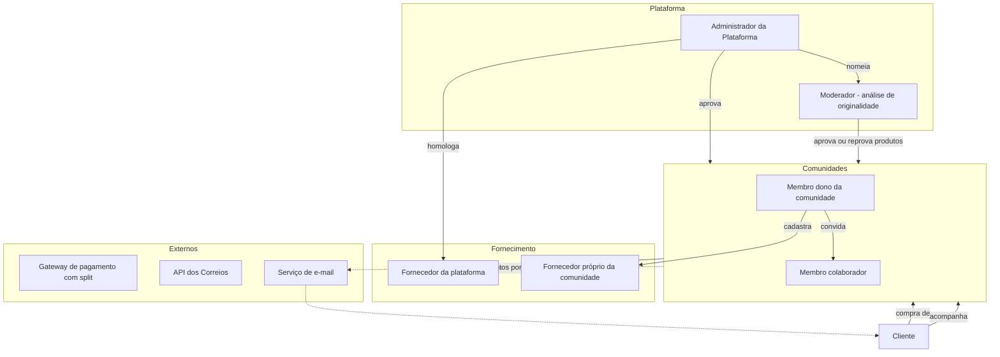

| Ator | Descrição | Principais ações |
|---|---|---|
| **Cliente** | Pessoa que compra na loja | Navegar, montar carrinho, calcular frete, pagar, acompanhar pedido, **acompanhar comunidades** |
| **Administrador da plataforma** | Mantenedores da Loja | Aprovar comunidades, homologar fornecedores globais, moderar produtos, mediar disputas, manter tabela de taxas |
| **Moderador** | Pessoa nomeada pelo admin (mantenedor ou voluntário de confiança das comunidades) | Analisar originalidade de produtos e coleções, pedir autorização à comunidade citada, aprovar/reprovar com motivo, tratar denúncias. Nunca analisa produto da própria comunidade |
| **Comunidade (lojista)** | Qualquer comunidade de tecnologia aprovada. Ex.: PHP Brasil, PHPeste, grupos de Python, JS, Java, dados, DevOps… | Cadastrar produtos, coleções, fornecedores e margens, ver vendas, financeiro e nº de seguidores |
| **Membro da comunidade** | Pessoa com acesso ao painel da comunidade (N por comunidade) | Papéis: **Dono** (tudo, incluindo financeiro e membros) e **Colaborador** (produtos e pedidos) |
| **Fornecedor** | Gráfica, fábrica de canecas, ateliê de mascotes/pelúcias etc. | Receber pedidos, atualizar status, informar rastreio, manter preço de custo e prazo de produção |
| **Fornecedor da plataforma** | Fornecedor homologado pelo admin e disponível para **todas** as comunidades | Mesmas ações de fornecedor |
| **Fornecedor próprio** | Cadastrado por uma comunidade e visível **só para ela** | Mesmas ações de fornecedor |
| **Gateway de pagamento** | Serviço de pagamento com split | Cobrar o cliente, dividir o valor e repassar para cada recebedor |
| **Correios** | API de cotação de frete e rastreio | Calcular preço e prazo, fornecer eventos de rastreio |

---

## 4. Business Model Canvas

| Bloco | Conteúdo |
|---|---|
| **Segmentos de clientes** | Pessoas desenvolvedoras e entusiastas de qualquer stack; participantes de eventos; empresas que patrocinam ou presenteiam times; colecionadores de mascotes (elePHPant etc.) |
| **Proposta de valor** | Todos os produtos oficiais das comunidades de tecnologia do Brasil em um só lugar, com preço acessível e dinheiro revertido para a própria comunidade |
| **Canais** | Site da Loja; divulgação nas comunidades (Telegram, Discord, redes sociais); QR code em eventos e meetups; links por comunidade (`/c/phpeste`); **e-mail de lançamento para seguidores** |
| **Relacionamento** | Comunitário e transparente: página da comunidade mostrando para onde vai o dinheiro; **acompanhar comunidades**; notificações de pedido e de lançamentos por e-mail |
| **Fontes de receita** | Comunidade: margem sobre o custo do fornecedor. Plataforma: **R$ 2,49 por saque** solicitado por comunidades e fornecedores, para cobrir os custos |
| **Recursos-chave** | Plataforma (código aberto?) com UI em DaisyUI, integração com gateway (split), integração Correios, rede de fornecedores homologados, voluntários mantenedores |
| **Atividades-chave** | Manter a plataforma; homologar fornecedores; apoiar comunidades a subir produtos; mediar problemas de entrega |
| **Parcerias-chave** | Fornecedores (gráficas, canecas, pelúcias); gateway de pagamento; Correios; organizações dos eventos |
| **Estrutura de custos** | Cobertos pela tarifa de saque: hospedagem e domínio; taxas do gateway (por transação, ver §6); envio de e-mails (cresce com o nº de seguidores); tempo de voluntários; eventual contrato com os Correios |

---

## 5. Acompanhar comunidades

O cliente pode **acompanhar quantas comunidades quiser**. Sempre que uma comunidade acompanhada **publicar algo novo**, o cliente recebe um **e-mail** sobre o lançamento.

### Eventos que geram notificação

A funcionalidade é pensada como **eventos de lançamento da comunidade**. Hoje são dois tipos, e novos tipos entram sem mudar o mecanismo:

| Evento | Quando dispara | Conteúdo do e-mail |
|---|---|---|
| `produto_publicado` | Produto é **aprovado na análise de originalidade** e publicado pela primeira vez (não dispara em edição de produto já publicado) | Foto, nome, preço, link do produto |
| `colecao_publicada` | Coleção/edição é aprovada e publicada (ex.: *PHPeste 2026*) | Banner, período de venda, tiragem, produtos da coleção |
| *futuro:* `pre_venda_aberta`, `produto_reposto`, `evento_anunciado`, `cupom_criado`… | Definido quando a funcionalidade existir | Modelo de e-mail próprio |

### Como funciona

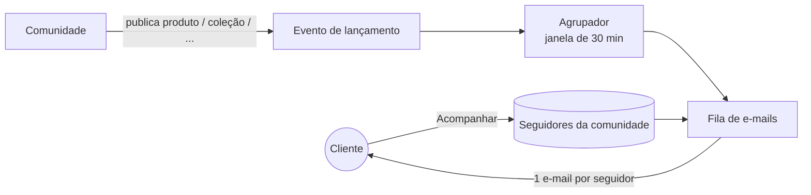

- **Agrupamento:** se a comunidade publicar vários produtos de uma vez (ex.: 8 camisas de uma coleção), o seguidor recebe **um e-mail** com todos os lançamentos, e não 8 e-mails. Os eventos da mesma comunidade são agrupados numa janela curta (sugestão: 30 min, configurável).
- **Preferências:** o cliente escolhe na conta quais tipos de lançamento quer receber e pode pausar todos.
- **Descadastro em 1 clique:** todo e-mail tem link para deixar de acompanhar aquela comunidade ou parar todos os e-mails de lançamento (LGPD e boas práticas antispam).
- **Quem pode acompanhar:** só cliente logado com e-mail confirmado (evita spam para e-mails de terceiros).
- **Para a comunidade:** o painel mostra o número de seguidores e quantos e-mails cada lançamento gerou. A comunidade **não** vê os e-mails dos seguidores.

---

## 6. Como o dinheiro circula (split)

### Composição do preço

```
Preço de venda do produto = Custo do fornecedor + Margem da comunidade
Base do pedido            = Σ (Preço de venda × qtd) + Σ Frete por fornecedor
Total cobrado do cliente  = Base do pedido + acréscimo de parcelamento (só em 2x–6x, se repassado)
```

### Tabela de taxas do gateway

| Forma de pagamento | Taxa | Tipo |
|---|---|---|
| **Pix** | R$ 2,49 | Fixa por transação |
| **Boleto** | R$ 2,49 | Fixa por transação |
| **Crédito à vista** | R$ 0,49 + 3,99% | Fixa + percentual sobre o total |
| **Crédito parcelado (2x a 6x)** | R$ 0,49 + 4,49% | Fixa + percentual sobre o total |

- Pix e boleto têm **taxa fixa em centavos**, não importa o valor do pedido. Só o cartão de crédito tem parte percentual.
- Parcelamento **máximo de 6x**.
- A taxa é cobrada **uma vez por pedido** (uma transação), mesmo com várias comunidades e fornecedores no carrinho.
- A tabela fica **configurável no admin com data de vigência**, e cada pagamento guarda a taxa aplicada (*snapshot*). Se o gateway mudar os preços, pedidos antigos não mudam.

### Duas escolhas da comunidade

**1. Parcelamento: repassar ou assumir** *(configuração da comunidade, tela C10)*

| Opção | Quem paga a taxa do parcelado (R$ 0,49 + 4,49%) | O cliente vê |
|---|---|---|
| **Repassar ao cliente** *(padrão)* | O cliente, como acréscimo no total | "6x de R$ 16,14 (total R$ 96,84)" |
| **Assumir (sem juros)** | A comunidade (e o fornecedor, se houver acordo, ver abaixo) | "6x de R$ 15,33 sem juros" |

**2. Taxa percentual do cartão: comunidade ou fornecedor** *(acordo por comunidade e fornecedor, tela C06)*

A comunidade negocia com cada fornecedor quem paga a parte percentual do cartão sobre o valor dele (custo + frete):

| Acordo | Efeito |
|---|---|
| **Comunidade absorve** *(padrão)* | O fornecedor recebe sempre custo + frete cheios. A comunidade paga toda a taxa |
| **Fornecedor absorve** | O fornecedor paga o percentual do cartão sobre o valor dele (custo + frete). A comunidade paga a parte fixa (R$ 0,49) e o percentual sobre a margem |

O acordo vale para **crédito à vista** e para **parcelado assumido pela comunidade**. Não se aplica a Pix e boleto (taxa fixa, sempre da comunidade) nem ao parcelado repassado (o cliente cobre a taxa inteira).

### Fórmulas

Arredondamento em centavos, meio para cima.

```
Pix / Boleto              taxa = 2,49

Crédito à vista           taxa = 0,49 + arred(base × 3,99%)

Crédito 2x–6x assumido    taxa = 0,49 + arred(base × 4,49%)

Crédito 2x–6x repassado   total = arred( (base + 0,49) / (1 − 4,49%) )
                          taxa  = 0,49 + arred(total × 4,49%)
                          acréscimo = total − base   (fica = taxa; diferença de 1 centavo fica com a comunidade)

Fornecedor absorve %      parte do fornecedor = arred(valor_fornecedor × percentual)
                          parte da comunidade = taxa − parte do fornecedor
```

- **Carrinho com comunidades que repassam e outras que assumem:** o acréscimo cobre só a parte da taxa das comunidades que repassam, pelo rateio da margem (RN20). Fórmula geral, com `r` = margem das comunidades que repassam ÷ margem total: `total = (base + r × 0,49) / (1 − r × 4,49%)`.
- **Fornecedor que atende várias comunidades com acordos diferentes:** o valor do fornecedor considerado é o custo dos itens de cada comunidade mais o frete do sub-pedido rateado pelo custo dos itens.

### Regra de divisão

| Recebedor | Recebe |
|---|---|
| **Fornecedor** | Custo dos itens + frete (menos o % do cartão, só se tiver acordo "fornecedor absorve") |
| **Comunidade** | Margem + acréscimo de parcelamento recebido − sua parte da taxa |
| **Gateway** | Taxa da transação (tabela acima) |
| **Plataforma** | **R$ 2,49 por saque** solicitado pela comunidade ou pelo fornecedor (não cobra nada sobre as vendas) |

**Monetização da plataforma: tarifa de saque.** O dinheiro das vendas fica como saldo de cada recebedor (comunidade ou fornecedor) na subconta dele no gateway. Sempre que uma **comunidade ou um fornecedor solicita um saque** para a conta bancária, a plataforma cobra **R$ 2,49 fixos**, usados para pagar os custos dela (hospedagem, e-mails, domínio etc.). A plataforma não cobra nada nas vendas: cada recebedor decide quando e quanto sacar, e sacar menos vezes com valores maiores fica mais barato.

> Exemplo: saldo disponível de R$ 1.180,00 → saque de R$ 1.180,00 → a comunidade recebe **R$ 1.177,51** na conta, e a plataforma fica com R$ 2,49. A regra é a mesma para o fornecedor: um saque de R$ 640,00 deposita R$ 637,51 na conta dele.

**Rateio entre comunidades:** a parte da taxa das comunidades é dividida **proporcionalmente à margem** de cada uma. Os centavos que sobram do arredondamento vão para a comunidade com a maior margem, para a soma bater exatamente.

### Exemplo 1: um produto, uma comunidade

| Item | Valor |
|---|---|
| Camisa PHPeste 2026 — custo fornecedor | R$ 45,00 |
| Margem da comunidade PHPeste | R$ 25,00 |
| **Preço de venda** | **R$ 70,00** |
| Frete PAC (cotação Correios) | R$ 22,00 |
| **Base do pedido** | **R$ 92,00** |

| Forma de pagamento | Cliente paga | Taxa do gateway | Fornecedor | Comunidade |
|---|---|---|---|---|
| Pix | R$ 92,00 | R$ 2,49 | R$ 67,00 | **R$ 22,51** |
| Boleto | R$ 92,00 | R$ 2,49 | R$ 67,00 | **R$ 22,51** |
| Crédito à vista (comunidade absorve) | R$ 92,00 | 0,49 + 3,67 = R$ 4,16 | R$ 67,00 | **R$ 20,84** |
| Crédito à vista (fornecedor absorve %) | R$ 92,00 | R$ 4,16 (forn. 2,67 · com. 1,49) | R$ 64,33 | **R$ 23,51** |
| Crédito 2x–6x **repassado** *(padrão)* | R$ 96,84 (6x R$ 16,14) | 0,49 + 4,35 = R$ 4,84 | R$ 67,00 | **R$ 25,00** |
| Crédito 2x–6x assumido (comunidade absorve) | R$ 92,00 | 0,49 + 4,13 = R$ 4,62 | R$ 67,00 | **R$ 20,38** |
| Crédito 2x–6x assumido (fornecedor absorve %) | R$ 92,00 | R$ 4,62 (forn. 3,01 · com. 1,61) | R$ 63,99 | **R$ 23,39** |

Em todas as linhas: cliente paga = taxa + fornecedor + comunidade ✅

> 💚 **Incentivo ao Pix:** no Pix a comunidade recebe R$ 22,51 e no crédito à vista recebe R$ 20,84. A loja mostra essa diferença ao cliente no carrinho e no checkout ("No Pix, a comunidade recebe R$ 1,67 a mais"). Quanto maior o pedido, maior a diferença: num pedido de R$ 300, o Pix custa R$ 2,49 e o crédito à vista custa R$ 12,46.

### Exemplo 2: carrinho com duas comunidades e dois fornecedores

Carrinho da tela L06: Camisa PHPeste (margem R$ 25) + Camisa PHP-SP (margem R$ 20) + mascote elePHPant PHPeste (margem R$ 40). Base R$ 307,00, sendo R$ 255,00 de produtos e R$ 52,00 de frete. Margens: **PHPeste R$ 65,00** e **PHP-SP R$ 20,00** (soma R$ 85,00). As duas comunidades usam os padrões (repassam o parcelamento; comunidade absorve o % do cartão).

| Forma | Cliente paga | Taxa total | PHPeste paga (65/85) | PHP-SP paga (20/85) | PHPeste recebe | PHP-SP recebe |
|---|---|---|---|---|---|---|
| Pix / Boleto | R$ 307,00 | R$ 2,49 | R$ 1,90 | R$ 0,59 | R$ 63,10 | R$ 19,41 |
| Crédito à vista | R$ 307,00 | 0,49 + 12,25 = R$ 12,74 | R$ 9,74 | R$ 3,00 | R$ 55,26 | R$ 17,00 |
| Crédito 2x–6x repassado | R$ 321,95 | 0,49 + 14,46 = R$ 14,95 | coberto pelo acréscimo | coberto pelo acréscimo | R$ 65,00 | R$ 20,00 |

Os fornecedores recebem o mesmo valor em todas as linhas (custo + frete de cada envio), porque nenhum acordo "fornecedor absorve" está ativo.

### Carrinho com várias comunidades e fornecedores

Um único checkout pode ter itens de comunidades e fornecedores diferentes. O pedido é quebrado em **sub-pedidos por fornecedor** (cada um tem origem, frete e rastreio próprios), e o split tem **um recebedor por comunidade e por fornecedor envolvido**.

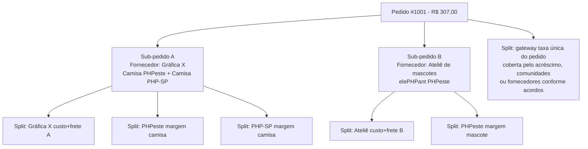

---

## 7. Regras de negócio

### Comunidades e membros
- **RN01** — Comunidade só vende após aprovação do administrador da plataforma. Critério sugerido: ser comunidade de tecnologia brasileira, sem fins lucrativos, com atividade pública recente (meetups, eventos, grupo ativo) e responsáveis identificados.
- **RN01a** — Comunidade informa as **tecnologias/temas** (ex.: PHP, Python, dados) e a **região**, usados em filtros e busca na loja.
- **RN02** — Comunidade precisa de conta recebedora (subconta) ativa no gateway para publicar produtos.
- **RN03** — Uma comunidade tem **1 ou mais membros**; ao menos um com papel **Dono**.
- **RN04** — Só **Dono** vê o financeiro, altera dados bancários e gerencia membros.
- **RN05** — Um usuário pode ser membro de mais de uma comunidade.
- **RN43** — 🔶 *Proposta em discussão, sub-pontos a validar com jurídico.* Comunidade **suspensa pelo admin** ou que solicita **encerramento** deixa de poder publicar produtos novos e some do diretório/busca, mas: (a) pedidos já pagos e ainda não entregues continuam até a conclusão do envio; (b) o saldo disponível na subconta segue sacável pelo(s) Dono(s) por um prazo após o encerramento (sugestão: 90 dias, a definir); (c) produtos publicados saem da vitrine mas seguem no histórico de pedidos de quem já comprou, como já vale para edição encerrada (RN13). Em aberto: prazo exato de retenção do saldo, e o que fazer se a comunidade suspensa tinha pedido em produção sem fornecedor confirmado.

### Fornecedores
- **RN06** — Fornecedor pode ser **da plataforma** (homologado pelo admin, visível para todas as comunidades) ou **próprio** (cadastrado pela comunidade, visível só para ela).
- **RN07** — Fornecedor precisa de subconta no gateway ativa e **CEP de origem** para cálculo de frete.
- **RN08** — Fornecedor mantém: preço de custo por variação (tamanho/cor), prazo de produção (dias) e dimensões/peso de envio.
- **RN09** — Se o fornecedor alterar o custo, os produtos afetados ficam **pendentes de revisão** pela comunidade (a margem não pode ficar negativa sem ninguém perceber).

### Produtos
- **RN10** — Produto pertence a **uma comunidade** e a **um fornecedor**.
- **RN11** — Preço de venda = custo do fornecedor + margem da comunidade (valor fixo ou %).
- **RN12** — Produto pode pertencer a uma **Coleção/Edição** (ex.: *PHPeste 2026*) com data de início e fim de venda e **tiragem limitada** opcional.
- **RN13** — Produtos de edição encerrada saem da vitrine, mas continuam no histórico.
- **RN13a** — Todo produto exibido na loja (vitrine, listagem, busca, coleção, detalhe, carrinho e checkout) mostra um **label com o nome da comunidade** a que pertence, com link para a página dela. Assim o cliente sempre sabe qual comunidade está apoiando.
- **RN42** — 🔶 *Proposta em discussão, parâmetros a validar.* Item de coleção/edição com **tiragem limitada** é reservado ao entrar no carrinho por um tempo curto (sugestão: 15 min, renovável enquanto o cliente segue ativo no checkout); a reserva expira e libera a unidade automaticamente se o pagamento não for concluído (ex.: Pix/boleto vencido). A confirmação definitiva da tiragem só ocorre no **pagamento confirmado** (RN16), por operação atômica no banco que verifica o limite no mesmo instante em que soma a venda. Se a tiragem já tiver esgotado nesse momento por concorrência entre reservas simultâneas, o sub-pedido é **cancelado automaticamente com estorno total** e o cliente é avisado. Objetivo: evitar vender a mesma unidade de edição limitada duas vezes.

### Análise de originalidade (anti-plágio)
- **RN32** — **Todo produto novo passa por análise humana** antes de ir para a vitrine. A comunidade envia para análise, e só um **moderador da plataforma** aprova a publicação.
- **RN33** — O moderador verifica se o produto **faz menção ou referência a outra comunidade**: nome, sigla, logo, mascote customizado (ex.: o elePHPant da PHPPI ou da PHPSP), evento ou arte identificável. Se o produto claramente pertence a outra comunidade, é **reprovado**.
- **RN33a** — **Mascote genérico da linguagem** (ex.: elePHPant sem customização) ou de projeto open source **não é aprovado automaticamente**. Todo produto assim passa pela **análise humana, caso a caso**, com as mesmas regras de originalidade.
- **RN34** — Antes da análise humana, o sistema faz uma **pré-checagem automática**: procura nomes, siglas e slugs de outras comunidades e de eventos no título, na descrição e nas tags, e lista produtos parecidos já publicados. O resultado só ajuda o moderador, nunca aprova ou reprova sozinho.
- **RN35** — **Exceção por autorização:** produto colaborativo ou com referência autorizada (ex.: camisa conjunta de dois meetups) só é aprovado com **autorização registrada da comunidade citada**, dada por um Dono dela na plataforma.
- **RN36** — A reprovação sempre tem **motivo escrito**. A comunidade pode corrigir e reenviar, ou **contestar** uma vez (a contestação vai para outro moderador).
- **RN37** — Em produto já publicado, mudanças em **nome, descrição, imagens ou arte** voltam para análise, e a versão anterior continua no ar até a aprovação. Mudança de preço, margem ou estoque não passa por análise.
- **RN38** — **Coleções** também passam pela análise (nome, banner e descrição).
- **RN39** — Qualquer comunidade pode **denunciar** um produto publicado que use sua identidade. A denúncia vai para a fila de moderação com prioridade, e o moderador pode tirar o produto da vitrine enquanto analisa.
- **RN40** — Moderador **não analisa produto da própria comunidade** (conflito de interesse).
- **RN41** — A notificação aos seguidores (RN27) só dispara quando o produto é **aprovado e publicado**.

### Pedido, frete e pagamento
- **RN14** — Frete calculado **por sub-pedido** (CEP origem do fornecedor → CEP do cliente), usando peso e dimensões somados dos itens.
- **RN15** — Prazo exibido ao cliente = prazo de produção do fornecedor + prazo dos Correios.
- **RN16** — Pedido só é enviado ao fornecedor **após pagamento confirmado** (webhook do gateway).
- **RN17** — Fornecedor tem **X dias úteis** (a definir) para informar o código de rastreio; se não informar, o pedido é sinalizado ao admin e à comunidade.
- **RN18** — Cancelamento antes da produção gera estorno total; depois da produção, segue a política da comunidade e o CDC (direito de arrependimento de 7 dias para compras online).

### Taxas e split
- **RN19** — Taxas do gateway: **Pix R$ 2,49**, **boleto R$ 2,49** (fixas), **crédito à vista R$ 0,49 + 3,99%**, **crédito 2x–6x R$ 0,49 + 4,49%**. Parcelamento máximo de 6x.
- **RN20** — A taxa é cobrada uma vez por pedido. A parte que cabe às **comunidades** é rateada **proporcionalmente à margem** de cada uma; a sobra de centavos do arredondamento vai para a comunidade de maior margem.
- **RN21** — **Parcelamento (2x–6x):** por padrão, a **taxa inteira do parcelado (R$ 0,49 + 4,49%)** é **repassada ao cliente** como acréscimo no total, e não só a diferença em relação ao crédito à vista. A comunidade pode escolher **assumir** a taxa e oferecer parcelamento sem juros (configuração em C10).
- **RN22** — **Taxa % do cartão:** por padrão a comunidade absorve e o fornecedor recebe custo + frete cheios. A comunidade pode negociar com cada fornecedor que ele **absorva o percentual do cartão sobre o valor dele** (custo + frete). O acordo vale para crédito à vista e parcelado assumido e é registrado por par comunidade–fornecedor (C06). Só vale depois que o fornecedor **aceitar** no painel dele.
- **RN23** — No checkout, formas de pagamento em que a parte da taxa paga pelas comunidades seria **maior que a soma das margens** não são oferecidas. O parcelado repassado nunca cai nessa regra.
- **RN24** — A loja mostra ao cliente, no carrinho e no checkout, **quanto a comunidade recebe a mais se ele pagar com Pix**.
- **RN24a** — Na tela de produto (C04), a comunidade vê a margem líquida em cada forma de pagamento, conforme suas configurações. O sistema **alerta** quando a margem líquida fica abaixo de um mínimo (sugestão: R$ 1,00).
- **RN24c** — **Tarifa de saque:** cada saque solicitado por **comunidade ou fornecedor** custa **R$ 2,49**, que vão para a plataforma. A tarifa é descontada do valor sacado. O valor do saque precisa ser **maior que R$ 2,49**. Na comunidade, só o **Dono** pode solicitar saque (RN04). No fornecedor, quem tem acesso ao painel dele. A tarifa é configurável no admin, com vigência, e cada saque guarda a tarifa aplicada.
- **RN24b** — A tabela de taxas é versionada com **data de vigência**. Cada pagamento guarda a taxa, o acréscimo e os acordos aplicados.

### Acompanhar comunidades
- **RN25** — Cliente logado e com e-mail confirmado pode acompanhar **quantas comunidades quiser** e deixar de acompanhar a qualquer momento.
- **RN26** — Geram notificação os **eventos de lançamento** da comunidade: hoje `produto_publicado` e `colecao_publicada`. Novos tipos de evento podem ser adicionados sem mudar a regra de envio.
- **RN27** — Só a **primeira publicação** dispara notificação. Editar, despublicar e republicar o mesmo produto não gera novo e-mail.
- **RN28** — Eventos da mesma comunidade em uma janela curta (sugestão: 30 min) são **agrupados em um único e-mail** por seguidor.
- **RN29** — Produto publicado **dentro de uma coleção** que está sendo publicada entra no e-mail da coleção, não em um e-mail separado.
- **RN30** — Todo e-mail de lançamento tem link de **descadastro em 1 clique** (desta comunidade ou de todos os lançamentos). O cliente escolhe na conta quais tipos de evento quer receber.
- **RN31** — A comunidade vê **apenas o número** de seguidores, nunca os dados pessoais deles.

### Privacidade e dados (LGPD)
- **RN44** — 🔶 *Proposta em discussão, prazos a validar com jurídico.* Dados pessoais do cliente (endereço, telefone) compartilhados com o fornecedor (necessários para o envio, ver Q10) são retidos pelo fornecedor apenas pelo tempo necessário à entrega e eventual troca/garantia (sugestão: 90 dias após a entrega, a definir). Cliente pode solicitar exclusão dos próprios dados pela conta; pedidos já concluídos mantêm os dados mínimos exigidos por obrigação fiscal/contábil, o resto é anonimizado. Complementa Q10.

---

## 8. Diagramas de fluxo

### 8.1 Onboarding da comunidade

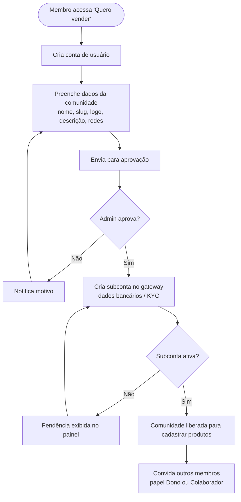

### 8.2 Cadastro de fornecedor

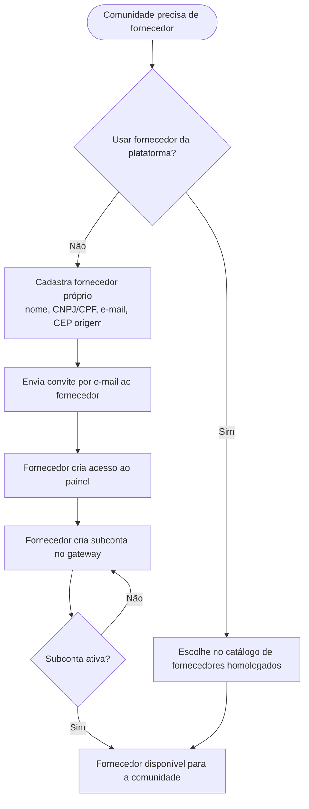

### 8.3 Cadastro de produto

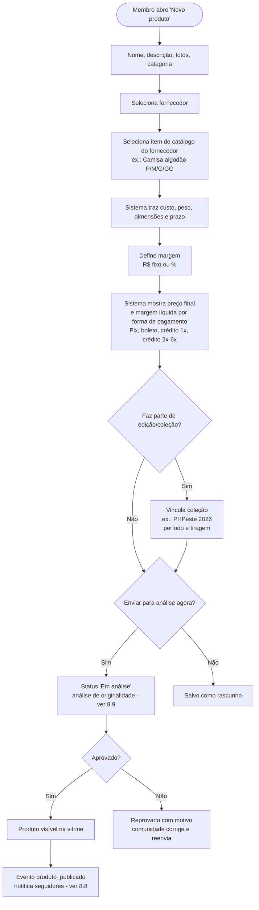

### 8.4 Jornada de compra

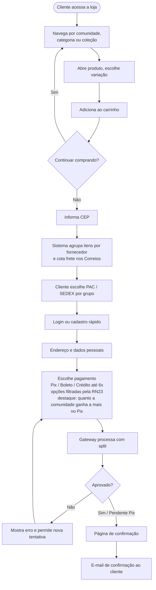

### 8.5 Atendimento do pedido pelo fornecedor

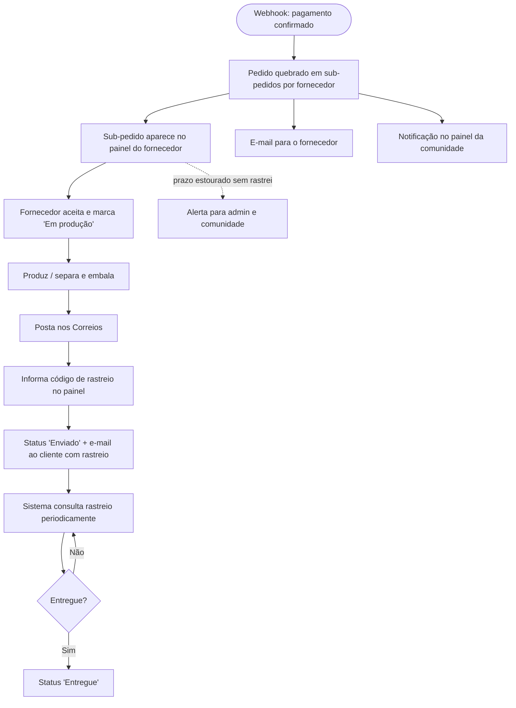

### 8.6 Cancelamento e estorno

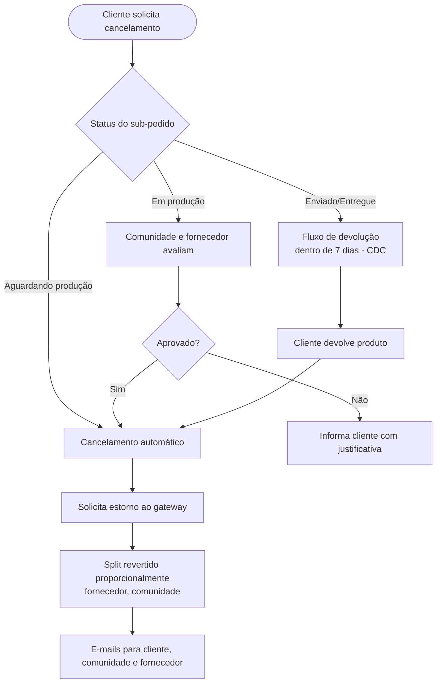

### 8.7 Acompanhar uma comunidade

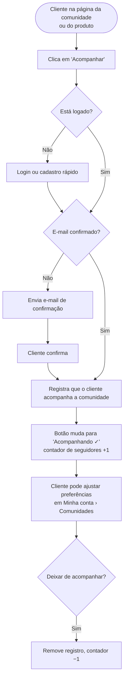

### 8.8 Notificação de lançamento para seguidores

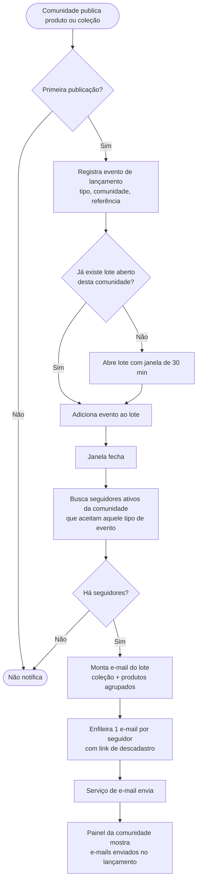

### 8.9 Análise de originalidade (anti-plágio)

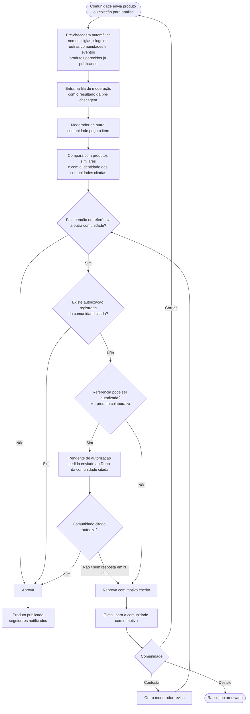

### 8.10 Denúncia de uso indevido

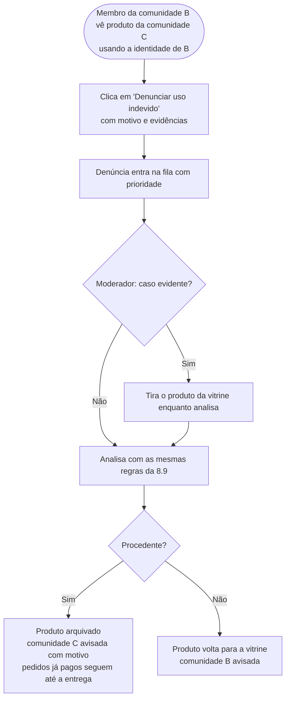

---

## 9. Diagramas de sequência

### 9.1 Cálculo de frete no carrinho

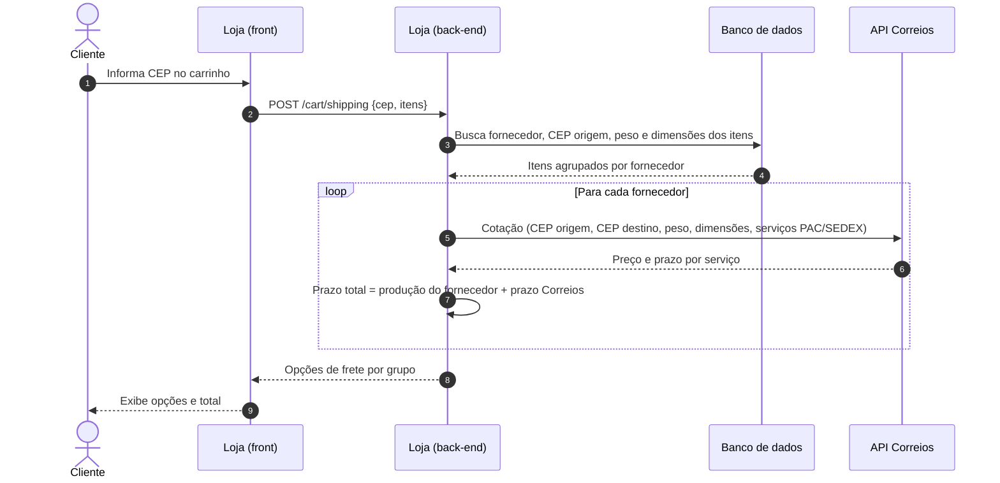

### 9.2 Checkout e pagamento com split

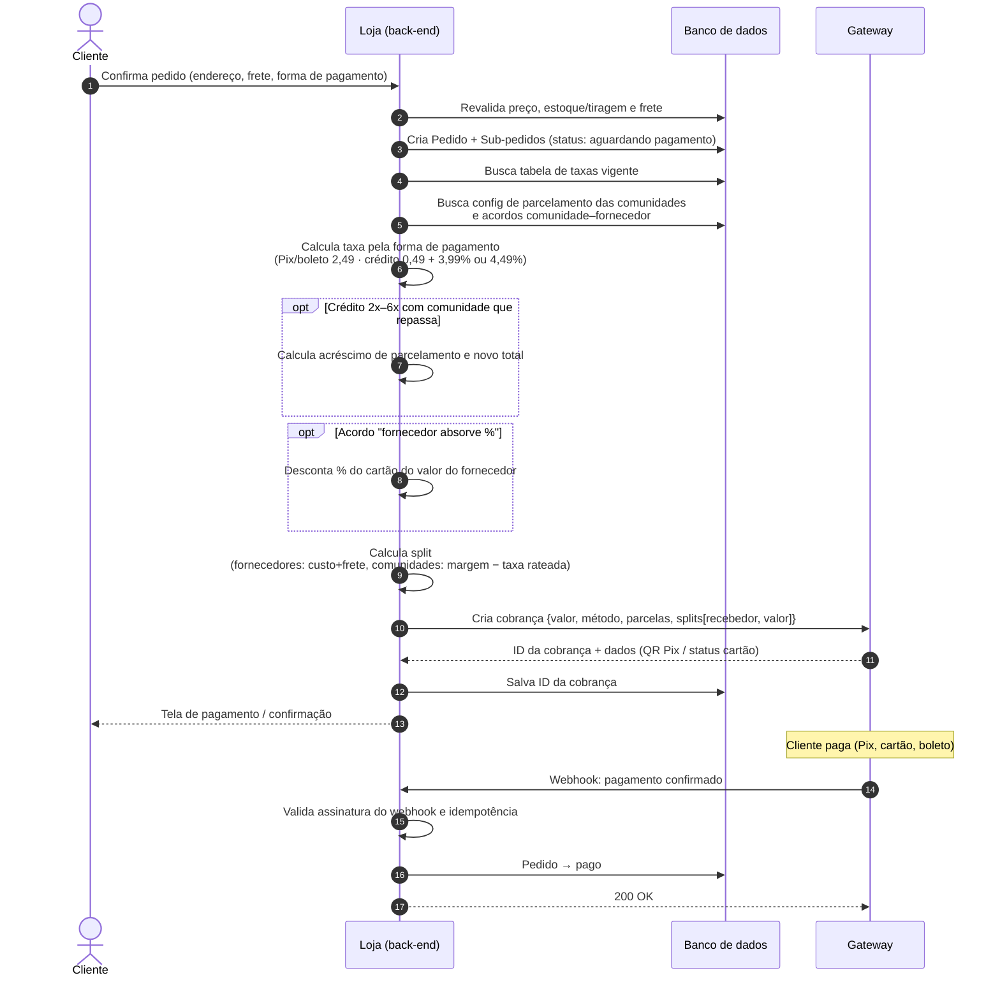

### 9.3 Notificação e atendimento pelo fornecedor

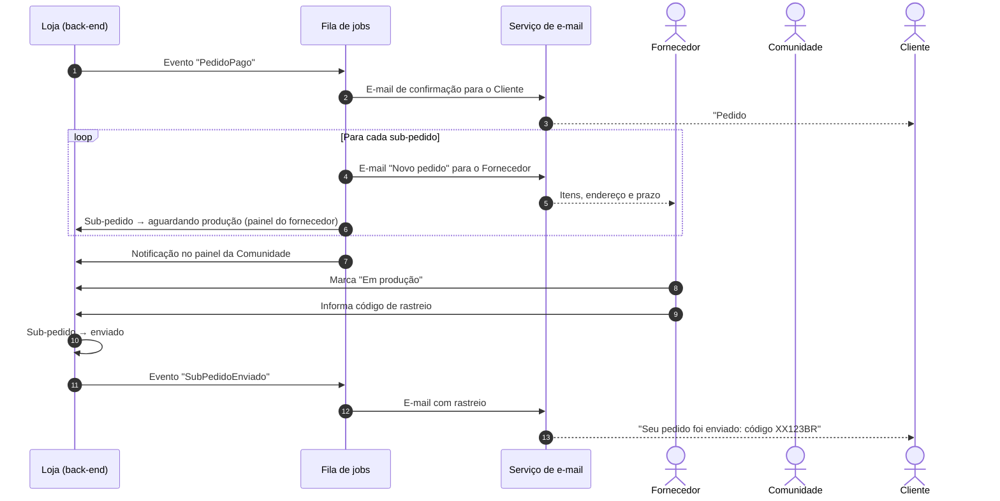

### 9.4 Acompanhamento de rastreio

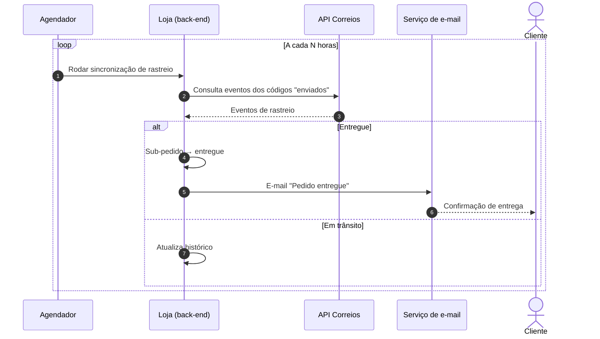

### 9.5 Estorno

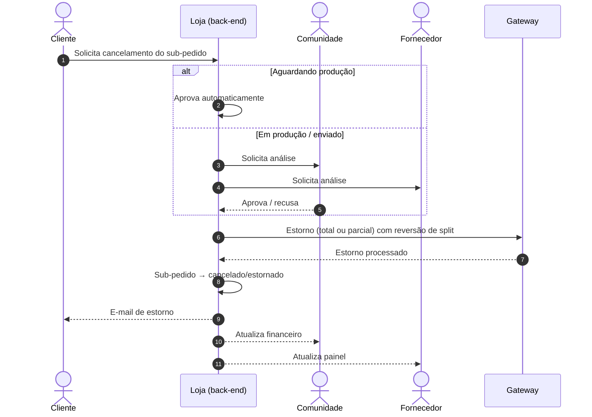

### 9.6 Acompanhar comunidade

```mermaid
sequenceDiagram
    autonumber
    actor Cliente
    participant Front as Loja (front)
    participant API as Loja (back-end)
    participant DB as Banco de dados

    Cliente->>Front: Clica "Acompanhar" na página da comunidade
    Front->>API: POST /comunidades/{slug}/seguidores
    API->>API: Verifica sessão e e-mail confirmado
    alt Não logado ou e-mail não confirmado
        API-->>Front: 401 / 403
        Front-->>Cliente: Login, cadastro ou confirmação de e-mail
    else OK
        API->>DB: INSERT seguidor (cliente, comunidade)<br/>ignora se já existir
        DB-->>API: OK
        API-->>Front: 201 {seguindo: true, total_seguidores}
        Front-->>Cliente: "Acompanhando ✓"
    end

    Cliente->>Front: Clica "Deixar de acompanhar"
    Front->>API: DELETE /comunidades/{slug}/seguidores
    API->>DB: Remove seguidor
    API-->>Front: 204
```

### 9.7 Lançamento e envio de e-mail para seguidores

```mermaid
sequenceDiagram
    autonumber
    actor Membro as Membro da comunidade
    participant API as Loja (back-end)
    participant DB as Banco de dados
    participant Fila as Fila de jobs
    participant Mail as Serviço de e-mail
    actor Seg as Seguidores

    Note over Membro,API: Produto/coleção já aprovado na análise de originalidade (9.8)
    API->>DB: Status → publicado (primeira vez)
    API->>DB: Grava evento de lançamento no lote aberto da comunidade
    API->>Fila: Agenda "EnviarLote" para o fim da janela (se lote novo)
    API-->>Membro: E-mail "Produto aprovado e publicado"

    Note over Fila: 30 min depois
    Fila->>DB: Fecha lote e carrega eventos
    Fila->>DB: Busca seguidores ativos + preferências (em páginas)
    loop Para cada página de seguidores
        Fila->>Mail: Envia e-mail do lote<br/>(produtos, coleção, link de descadastro)
        Mail-->>Seg: "PHPeste lançou 3 produtos novos"
    end
    Fila->>DB: Salva nº de e-mails enviados no lote

    Seg->>API: Clica "descadastrar" (link assinado)
    API->>DB: Remove seguidor ou desliga o tipo de evento
```

### 9.8 Análise de originalidade

```mermaid
sequenceDiagram
    autonumber
    actor Membro as Membro da comunidade C
    participant API as Loja (back-end)
    participant DB as Banco de dados
    actor Mod as Moderador
    actor DonoB as Dono da comunidade B (citada)
    participant Mail as Serviço de e-mail

    Membro->>API: Envia produto para análise
    API->>DB: Produto → em_analise, cria análise (versão N)
    API->>API: Pré-checagem: busca referências a outras comunidades<br/>e produtos similares
    API->>DB: Salva resultado da pré-checagem
    API-->>Membro: "Enviado para análise"

    Mod->>API: Abre fila de moderação
    API->>DB: Itens pendentes (exceto da comunidade do moderador)
    API-->>Mod: Produto + pré-checagem + similares lado a lado

    alt Sem referência a outra comunidade
        Mod->>API: Aprova
    else Referência à comunidade B, sem autorização
        Mod->>API: Solicita autorização à comunidade B
        API->>Mail: E-mail para o Dono de B
        Mail-->>DonoB: "Comunidade C quer vender produto que cita B"
        alt B autoriza
            DonoB->>API: Autoriza
            API->>DB: Registra autorização
            Mod->>API: Aprova
        else B recusa ou não responde no prazo
            Mod->>API: Reprova com motivo
        end
    else Plágio evidente
        Mod->>API: Reprova com motivo
    end

    API->>DB: Atualiza análise e status do produto
    API->>Mail: Resultado para a comunidade C
    Mail-->>Membro: "Aprovado e publicado" ou "Reprovado: motivo"
    opt Aprovado
        API->>API: Dispara produto_publicado (9.7)
    end
```

### 9.9 Saque (comunidade ou fornecedor)

O fluxo é o mesmo para o fornecedor, que solicita pelo painel dele (F06). No exemplo, quem saca é a comunidade.

```mermaid
sequenceDiagram
    autonumber
    actor Dono as Dono da comunidade
    participant API as Loja (back-end)
    participant DB as Banco de dados
    participant GEF as Gateway

    Dono->>API: Solicita saque de R$ 1.180,00
    API->>API: Verifica papel Dono e valor > R$ 2,49
    API->>GEF: Consulta saldo disponível da subconta
    GEF-->>API: R$ 1.180,00 disponível
    API->>DB: Cria saque (valor 1.180,00 · tarifa 2,49 · líquido 1.177,51)
    API->>GEF: Transfere R$ 2,49 da subconta da comunidade para a conta da plataforma
    API->>GEF: Solicita saque de R$ 1.177,51 para a conta bancária da comunidade
    GEF-->>API: Saque em processamento
    API-->>Dono: "Saque solicitado: R$ 1.177,51"
    GEF->>API: Webhook: saque pago
    API->>DB: Saque → pago
    API-->>Dono: E-mail de confirmação do saque
```

---

## 10. Ciclos de vida

### 10.1 Pedido

Status aplicado a cada **sub-pedido** (um por fornecedor). O pedido geral mostra o status agregado.

```mermaid
stateDiagram-v2
    [*] --> AguardandoPagamento
    AguardandoPagamento --> Pago: webhook confirmado
    AguardandoPagamento --> Expirado: Pix/boleto vencido
    Pago --> AguardandoProducao: enviado ao fornecedor
    AguardandoProducao --> EmProducao: fornecedor aceita
    AguardandoProducao --> Cancelado: cliente/admin cancela
    EmProducao --> Enviado: rastreio informado
    EmProducao --> Cancelado: acordo entre partes
    Enviado --> Entregue: rastreio Correios
    Enviado --> ProblemaEntrega: extravio / devolvido ao remetente
    ProblemaEntrega --> Enviado: reenvio
    ProblemaEntrega --> Cancelado
    Entregue --> EmDevolucao: arrependimento (7 dias)
    EmDevolucao --> Estornado
    Cancelado --> Estornado: se já pago
    Entregue --> [*]
    Estornado --> [*]
    Expirado --> [*]
```

### 10.2 Produto

```mermaid
stateDiagram-v2
    [*] --> Rascunho
    Rascunho --> EmAnalise: enviar para análise
    EmAnalise --> AguardandoAutorizacao: cita outra comunidade
    AguardandoAutorizacao --> EmAnalise: autorização respondida
    EmAnalise --> Publicado: aprovado
    EmAnalise --> Reprovado: reprovado com motivo
    Reprovado --> Rascunho: corrigir
    Reprovado --> EmAnalise: contestar (1 vez)
    Publicado --> EmAnalise: alteração de nome/descrição/arte<br/>(versão anterior segue no ar)
    Publicado --> RevisaoCusto: fornecedor mudou custo
    RevisaoCusto --> Publicado: comunidade revisa margem
    Publicado --> Suspenso: denúncia evidente
    Suspenso --> Publicado: denúncia improcedente
    Suspenso --> Arquivado: denúncia procedente
    Publicado --> Arquivado: comunidade retira / coleção encerrada
    Arquivado --> [*]
```

---

## 11. Modelo de dados (conceitual)

```mermaid
erDiagram
    USUARIO ||--o{ MEMBRO_COMUNIDADE : "participa"
    COMUNIDADE ||--o{ MEMBRO_COMUNIDADE : "tem"
    COMUNIDADE ||--o{ PRODUTO : "vende"
    COMUNIDADE ||--o{ COMUNIDADE_FORNECEDOR : "usa"
    PRODUTO ||--o{ ANALISE_PRODUTO : "passa por"
    COLECAO ||--o{ ANALISE_PRODUTO : "passa por"
    ANALISE_PRODUTO }o--o{ AUTORIZACAO_REFERENCIA : "considera"
    COMUNIDADE ||--o{ AUTORIZACAO_REFERENCIA : "autoriza outra"
    COMUNIDADE ||--o{ DENUNCIA : "denuncia"
    PRODUTO ||--o{ DENUNCIA : "denunciado em"
    FORNECEDOR ||--o{ COMUNIDADE_FORNECEDOR : "atende"
    FORNECEDOR ||--o{ ITEM_FORNECEDOR : "oferece"
    ITEM_FORNECEDOR ||--o{ VARIACAO_ITEM : "tem"
    PRODUTO }o--|| ITEM_FORNECEDOR : "baseado em"
    PRODUTO }o--o| COLECAO : "pertence a"
    COMUNIDADE ||--o{ COLECAO : "cria"
    CLIENTE ||--o{ PEDIDO : "faz"
    PEDIDO ||--|{ SUB_PEDIDO : "dividido em"
    SUB_PEDIDO }o--|| FORNECEDOR : "atendido por"
    SUB_PEDIDO ||--|{ ITEM_PEDIDO : "contém"
    ITEM_PEDIDO }o--|| PRODUTO : "de"
    PEDIDO ||--|| PAGAMENTO : "pago por"
    PAGAMENTO ||--|{ SPLIT : "dividido em"
    PAGAMENTO }o--|| TABELA_TAXA : "usa taxa vigente"
    COMUNIDADE ||--o{ SAQUE : "solicita"
    FORNECEDOR ||--o{ SAQUE : "solicita"
    CLIENTE ||--o{ SEGUIDOR : "acompanha"
    COMUNIDADE ||--o{ SEGUIDOR : "é acompanhada"
    COMUNIDADE ||--o{ LOTE_LANCAMENTO : "gera"
    LOTE_LANCAMENTO ||--|{ EVENTO_LANCAMENTO : "agrupa"
    COMUNIDADE }o--o{ TECNOLOGIA : "tem temas"

    COMUNIDADE {
        uuid id
        string nome
        string slug
        string regiao
        int total_seguidores
        string parcelamento "repassar|assumir"
        string status "pendente|aprovada|suspensa"
        string gateway_recebedor_id
    }
    COMUNIDADE_FORNECEDOR {
        uuid comunidade_id
        uuid fornecedor_id
        string taxa_cartao_pct "comunidade|fornecedor"
        datetime acordo_aceito_em "aceite do fornecedor"
    }
    ANALISE_PRODUTO {
        uuid id
        string alvo "produto|colecao"
        int versao
        json precheck "referências encontradas"
        uuid moderador_id
        string resultado "pendente|aprovado|reprovado"
        string motivo
        boolean contestada
    }
    AUTORIZACAO_REFERENCIA {
        uuid id
        uuid comunidade_autorizante_id
        uuid comunidade_autorizada_id
        uuid produto_id
        uuid dono_que_autorizou_id
        datetime concedida_em
    }
    DENUNCIA {
        uuid id
        string motivo
        string status "aberta|procedente|improcedente"
    }
    MEMBRO_COMUNIDADE {
        uuid usuario_id
        uuid comunidade_id
        string papel "dono|colaborador"
    }
    FORNECEDOR {
        uuid id
        string nome
        string documento
        string email
        string cep_origem
        string escopo "plataforma|proprio"
        uuid comunidade_dona_id "nulo se plataforma"
        string gateway_recebedor_id
    }
    ITEM_FORNECEDOR {
        uuid id
        string nome
        int prazo_producao_dias
    }
    VARIACAO_ITEM {
        uuid id
        string atributos "tamanho, cor"
        decimal custo
        int peso_g
        string dimensoes_cm
    }
    PRODUTO {
        uuid id
        string nome
        string tipo_margem "fixo|percentual"
        decimal margem
        string status "rascunho|em_analise|reprovado|publicado|revisao_custo|arquivado"
    }
    COLECAO {
        uuid id
        string nome "PHPeste 2026"
        date inicio_venda
        date fim_venda
        int tiragem_max
    }
    PEDIDO {
        uuid id
        decimal total
        string status
    }
    SUB_PEDIDO {
        uuid id
        decimal frete
        string servico_frete "PAC|SEDEX"
        string codigo_rastreio
        string status
    }
    ITEM_PEDIDO {
        uuid id
        int quantidade
        decimal custo_unitario "snapshot"
        decimal margem_unitaria "snapshot"
    }
    PAGAMENTO {
        uuid id
        string gateway_cobranca_id
        string metodo "pix|boleto|credito"
        int parcelas "1 a 6"
        decimal acrescimo_parcelamento "0 se sem juros"
        decimal taxa_fixa "snapshot"
        decimal taxa_percentual "snapshot"
        decimal taxa_total
        string status
    }
    TABELA_TAXA {
        uuid id
        string metodo "pix|boleto|credito_1x|credito_2a6x"
        decimal fixa "2,49 | 0,49"
        decimal percentual "0 | 3,99 | 4,49"
        date vigencia_inicio
        date vigencia_fim
    }
    SEGUIDOR {
        uuid cliente_id
        uuid comunidade_id
        string tipos_evento "lista; vazio = todos"
        datetime desde
    }
    EVENTO_LANCAMENTO {
        uuid id
        string tipo "produto_publicado|colecao_publicada|..."
        string referencia_id
        datetime criado_em
    }
    LOTE_LANCAMENTO {
        uuid id
        datetime fecha_em
        string status "aberto|enviado"
        int emails_enviados
    }
    TECNOLOGIA {
        uuid id
        string nome "PHP, Python, Dados..."
    }
    SAQUE {
        uuid id
        string recebedor_tipo "comunidade|fornecedor"
        uuid recebedor_id
        uuid solicitado_por
        decimal valor
        decimal tarifa_plataforma "2,49 snapshot"
        decimal valor_liquido
        string status "solicitado|processando|pago|falhou"
        datetime solicitado_em
    }
    SPLIT {
        uuid id
        string recebedor_tipo "fornecedor|comunidade|gateway|plataforma"
        string recebedor_id
        decimal valor
    }
```

> **Importante:** custo e margem são gravados como *snapshot* no `ITEM_PEDIDO`. Mudanças futuras de preço não alteram pedidos já feitos nem o split deles.

---

## 12. Telas envolvidas

### Biblioteca de UI: DaisyUI

As telas serão desenhadas e implementadas com **[DaisyUI](https://daisyui.com/)**, uma biblioteca de componentes para Tailwind CSS.

A DaisyUI tem uma **skill** para agentes de IA, e ela **deve ser usada** para desenhar e implementar as telas:

```bash
npx -y skills add saadeghi/daisyui
```

Correspondência sugerida entre os wireframes e os componentes DaisyUI:

| Elemento dos wireframes | Componente DaisyUI |
|---|---|
| Cabeçalho da loja, busca, carrinho | `navbar`, `input`, `indicator`, `dropdown` |
| Menu lateral dos painéis | `drawer` + `menu` |
| Cards de produto e comunidade | `card`, `badge` (label da comunidade no produto, RN13a) |
| Banner de coleção/edição | `hero`, `countdown` |
| Botão Acompanhar / Acompanhando | `btn`, `dropdown` |
| Variações (P/M/G/GG), forma de pagamento | `join` + `radio`, `select` |
| Tabelas (pedidos, financeiro, saques) | `table` |
| Números do financeiro e dashboard | `stat` |
| Status de pedido e de análise | `badge`, `steps` |
| Destaque do Pix, avisos de margem e análise | `alert` |
| Confirmação de saque, reprovar com motivo | `modal`, `textarea` |
| Formulários de cadastro | `fieldset`, `input`, `select`, `toggle`, `file-input` |
| Checkout em etapas | `steps` |
| Feedback de ações (salvo, enviado) | `toast` |

- Tema: o tema da DaisyUI (cores, bordas, fontes) será definido junto com a identidade visual da loja. Os temas claro e escuro vêm prontos.
- Os wireframes desta seção são de baixa fidelidade. O desenho final segue os componentes e o tema da DaisyUI.

### 12.1 Inventário de telas

| # | Área | Tela | Ator | Principais elementos |
|---|---|---|---|---|
| L01 | Loja | Home | Cliente | Destaques, coleções ativas (ex.: PHPeste 2026), comunidades por tecnologia, lançamentos das comunidades acompanhadas, mais vendidos |
| L02 | Loja | Página da comunidade | Cliente | Logo, tecnologias, região, descrição, "para onde vai o dinheiro", **botão Acompanhar** + nº de seguidores, coleções, produtos |
| L03 | Loja | Listagem / busca | Cliente | Filtros por tecnologia, região, comunidade, categoria, coleção, preço |
| L03b | Loja | Diretório de comunidades | Cliente | Todas as comunidades, filtro por tecnologia e região, Acompanhar direto no card |
| L04 | Loja | Página de coleção/edição | Cliente | Banner do evento, contagem regressiva, tiragem restante |
| L05 | Loja | Detalhe do produto | Cliente | Label da comunidade (RN13a), fotos, variações, preço, simulador de frete, prazo, "quanto vai para a comunidade", Acompanhar comunidade, link "Denunciar uso indevido" (visível para membros de comunidades) |
| L06 | Loja | Carrinho | Cliente | Itens agrupados por envio, CEP, escolha de frete por grupo |
| L07 | Loja | Checkout — identificação/endereço | Cliente | Login/cadastro rápido, endereço (autocompletar via CEP) |
| L08 | Loja | Checkout — pagamento | Cliente | Pix, boleto, crédito 1x a 6x com acréscimo (ou sem juros, se a comunidade assumir), filtrado pela RN23; quanto as comunidades recebem em cada opção; resumo |
| L09 | Loja | Confirmação | Cliente | Número do pedido, QR Pix, próximos passos |
| L10 | Loja | Minha conta — pedidos | Cliente | Lista, status por envio, rastreio, cancelar/devolver |
| L11 | Loja | Minha conta — comunidades acompanhadas | Cliente | Lista de comunidades, tipos de lançamento por comunidade, deixar de acompanhar, pausar todos os e-mails |
| L12 | Loja | Descadastro (página do link do e-mail) | Cliente | Confirmação sem login: deixar esta comunidade ou todos os lançamentos |
| C01 | Painel Comunidade | Onboarding / cadastro | Membro | Dados da comunidade, status de aprovação, subconta no gateway |
| C02 | Painel Comunidade | Dashboard | Membro | Vendas do período, pedidos pendentes, **nº de seguidores**, alertas (custo alterado, atraso, margem baixa) |
| C03 | Painel Comunidade | Produtos (lista) | Membro | Status (rascunho, em análise, aguardando autorização, reprovado, publicado), preço, margem, fornecedor, motivo de reprovação |
| C04 | Painel Comunidade | Produto (form) | Membro | Dados, fornecedor, variações, margem, margem líquida por forma de pagamento, aviso de que publicar notifica os seguidores |
| C05 | Painel Comunidade | Coleções / edições | Membro | Período, tiragem, produtos vinculados, publicar coleção (notifica seguidores) |
| C05b | Painel Comunidade | Lançamentos | Membro | Histórico de lotes de lançamento, e-mails enviados por lote |
| C06 | Painel Comunidade | Fornecedores | Membro | Da plataforma (catálogo) e próprios; convidar fornecedor; **acordo de taxa % do cartão** (comunidade ou fornecedor absorve) e status do aceite |
| C07 | Painel Comunidade | Pedidos | Membro | Pedidos com itens da comunidade, status, rastreio |
| C08 | Painel Comunidade | Financeiro | Dono | Saldo disponível, a receber, estornos, extrato por pedido com forma de pagamento e taxa, **solicitar saque** (mostra a tarifa de R$ 2,49 e o valor líquido), histórico de saques |
| C09 | Painel Comunidade | Membros | Dono | Convidar, papéis, remover |
| C10 | Painel Comunidade | Configurações | Dono | Perfil público, tecnologias e região, dados bancários (gateway), política de troca, **parcelamento: repassar ao cliente (padrão) ou assumir** |
| C11 | Painel Comunidade | Autorizações e denúncias | Dono | Pedidos de outras comunidades para usar referência à sua (autorizar/recusar), autorizações concedidas, denúncias feitas e seus resultados |
| F01 | Painel Fornecedor | Onboarding | Fornecedor | Aceitar convite, dados, CEP origem, subconta no gateway |
| F02 | Painel Fornecedor | Dashboard | Fornecedor | Novos pedidos, em produção, atrasados |
| F03 | Painel Fornecedor | Catálogo de itens | Fornecedor | Itens, variações, custo, peso/dimensões, prazo de produção |
| F04 | Painel Fornecedor | Pedidos (lista) | Fornecedor | Filtro por status, comunidade, prazo |
| F05 | Painel Fornecedor | Pedido (detalhe) | Fornecedor | Itens com arte/estampa, endereço, etiqueta, informar rastreio |
| F06 | Painel Fornecedor | Financeiro | Fornecedor | Saldo disponível, a receber, por comunidade, **solicitar saque** (tarifa de R$ 2,49 e valor líquido), histórico de saques |
| A01 | Admin | Dashboard | Admin | GMV, pedidos, comunidades ativas, alertas |
| A02 | Admin | Comunidades | Admin | Aprovar, suspender |
| A03 | Admin | Fornecedores da plataforma | Admin | Homologar, suspender |
| A04 | Admin | Pedidos e disputas | Admin | Busca global, mediação, estornos |
| A05 | Admin | Configurações | Admin | **Tabela de taxas do gateway com vigência**, janela de agrupamento de lançamentos, prazos (RN17), integrações |
| A06 | Admin | Tecnologias | Admin | Cadastro de tecnologias/temas usados nos filtros |
| A07 | Moderação | Fila de análise | Moderador | Produtos/coleções pendentes, denúncias (prioridade), filtros, tempo na fila |
| A08 | Moderação | Análise do produto | Moderador | Produto enviado × produtos similares lado a lado, alertas da pré-checagem, histórico de versões, aprovar / reprovar com motivo / pedir autorização |
| A09 | Admin | Moderadores | Admin | Nomear moderadores, comunidade de cada um (para evitar conflito), volume analisado |
| E01 | E-mail | Pedido confirmado | Cliente | |
| E02 | E-mail | Novo pedido | Fornecedor | |
| E03 | E-mail | Pedido enviado (rastreio) | Cliente | |
| E04 | E-mail | Pedido entregue | Cliente | |
| E05 | E-mail | Estorno | Cliente, Comunidade, Fornecedor | |
| E06 | E-mail | Convite | Membro, Fornecedor | |
| E07 | E-mail | Alerta de atraso | Comunidade, Admin | |
| E08 | E-mail | Lançamento da comunidade (produto e/ou coleção, agrupado) | Seguidor | |
| E09 | E-mail | Confirmação de e-mail (necessário para acompanhar) | Cliente | |
| E10 | E-mail | Resultado da análise (aprovado e publicado / reprovado com motivo) | Comunidade | |
| E11 | E-mail | Pedido de autorização de referência | Dono da comunidade citada | |
| E12 | E-mail | Acordo de taxa do cartão para aceitar | Fornecedor | |
| E13 | E-mail | Resultado de denúncia | Comunidade denunciante e denunciada | |

### 12.2 Wireframes de baixa fidelidade

**L01 — Home**
```
┌────────────────────────────────────────────────────────────┐
│ 🛍 Loja das Comunidades Tech BR  [buscar...]    👤  🛒(2)  │
├────────────────────────────────────────────────────────────┤
│  ╔══════════════════════════════════════════════════════╗  │
│  ║  PHPeste 2026 — itens exclusivos da edição           ║  │
│  ║  Vendas até 30/11 · tiragem limitada   [Ver coleção] ║  │
│  ╚══════════════════════════════════════════════════════╝  │
│                                                            │
│  Tecnologias                                               │
│  [PHP] [Python] [JS] [Java] [Go] [Dados] [DevOps] [+]      │
│                                                            │
│  Novidades das comunidades que você acompanha              │
│  ┌────────┐ ┌────────┐ ┌────────┐                          │
│  │ [img]  │ │ [img]  │ │ [img]  │                          │
│  │Caneca  │ │Mascote │ │Camisa  │                          │
│  │PHP BR  │ │PHP-SP  │ │PHPeste │                          │
│  │R$ 45   │ │R$ 120  │ │R$ 70   │                          │
│  └────────┘ └────────┘ └────────┘                          │
│                                                            │
│  Comunidades em destaque                    [ver todas →]  │
│  (PHP BR ✓) (PHPeste ✓) (Python X) (JS Y) (Dados Z)        │
└────────────────────────────────────────────────────────────┘
```

**L02 — Página da comunidade**
```
┌────────────────────────────────────────────────────────────┐
│ ← Comunidades                                              │
│ [logo]  Comunidade PHPeste                                 │
│         PHP · Nordeste         👥 1.284 seguidores         │
│                                  [ ＋ Acompanhar ]         │
│                                                            │
│  Evento de PHP do Nordeste. O dinheiro da loja financia    │
│  o PHPeste, bolsas de ingresso e meetups na região.        │
│  💚 R$ 12.430 arrecadados em 2026                          │
│                                                            │
│  Coleções                                                  │
│  [PHPeste 2026 — até 30/11]  [PHPeste 2025 — encerrada]    │
│                                                            │
│  Produtos                                                  │
│  ┌────────┐ ┌────────┐ ┌────────┐ ┌────────┐               │
│  │Camisa  │ │Caneca  │ │elePHP- │ │Ecobag  │               │
│  │R$ 70   │ │R$ 45   │ │ant 120 │ │R$ 35   │               │
│  └────────┘ └────────┘ └────────┘ └────────┘               │
└────────────────────────────────────────────────────────────┘
  Depois de clicar:  [ ✓ Acompanhando ▾ ]
                       ├ Preferências de e-mail
                       └ Deixar de acompanhar
```

**L05 — Detalhe do produto**
```
┌────────────────────────────────────────────────────────────┐
│ ← PHPeste / Camisas                                        │
│ ┌──────────────────┐  Camisa Oficial PHPeste 2026          │
│ │                  │  por Comunidade PHPeste [＋Acompanhar] │
│ │      [foto]      │                                       │
│ │                  │  R$ 70,00                             │
│ └──────────────────┘  💚 até R$ 25,00 apoiam a comunidade  │
│ [▫][▫][▫]                                                  │
│                       Tamanho: (P) (M) (G) (GG)            │
│                       Qtd: [- 1 +]                         │
│                                                            │
│                       Calcular frete: [00000-000] [OK]     │
│                        PAC   R$ 22,00 · até 12 dias úteis  │
│                        SEDEX R$ 38,00 · até 8 dias úteis   │
│                        (inclui 5 dias de produção)         │
│                                                            │
│                       [   Adicionar ao carrinho   ]        │
│  Edição limitada: restam 47 de 200                         │
└────────────────────────────────────────────────────────────┘
```

**L06 — Carrinho (agrupado por envio)**
```
┌────────────────────────────────────────────────────────────┐
│ Seu carrinho                          CEP: [50000-000] [OK]│
├────────────────────────────────────────────────────────────┤
│ 📦 Envio 1 — sai de Recife/PE                              │
│   Camisa PHPeste 2026 (M) x1 ............... R$  70,00     │
│   Camisa PHP-SP (G) x1 ..................... R$  65,00     │
│   Frete: (•) PAC R$ 24,00 12d  ( ) SEDEX R$ 41,00 7d       │
├────────────────────────────────────────────────────────────┤
│ 📦 Envio 2 — sai de São Paulo/SP                           │
│   elePHPant PHPeste x1 ..................... R$ 120,00     │
│   Frete: (•) PAC R$ 28,00 15d  ( ) SEDEX R$ 52,00 9d       │
├────────────────────────────────────────────────────────────┤
│ Subtotal R$ 255,00 · Frete R$ 52,00 · Total R$ 307,00      │
│ 💚 R$ 85,00 vão para as comunidades                        │
│                                  [ Finalizar compra → ]    │
└────────────────────────────────────────────────────────────┘
```

**L08 — Checkout: pagamento**
```
┌────────────────────────────────────────────────────────────┐
│ Pagamento                                 Base R$ 307,00   │
├────────────────────────────────────────────────────────────┤
│ (•) Pix · R$ 307,00                                        │
│     💚 comunidades recebem R$ 82,51                        │
│ ( ) Boleto · R$ 307,00 (compensa em até 3 dias úteis)      │
│     💚 comunidades recebem R$ 82,51                        │
│ ( ) Cartão de crédito                                      │
│     [1x de R$ 307,00                              ▾]       │
│      ├ 1x de R$ 307,00                                     │
│      ├ 2x de R$ 160,98  (total R$ 321,95)                  │
│      ├ ...                                                 │
│      └ 6x de R$ 53,66   (total R$ 321,95)                  │
│     💚 comunidades recebem R$ 72,26 à vista                │
│                                                            │
│ ┌────────────────────────────────────────────────────────┐ │
│ │ 💡 Pagando no Pix, as comunidades recebem R$ 10,25 a   │ │
│ │    mais do que no cartão à vista.                      │ │
│ └────────────────────────────────────────────────────────┘ │
│                                   [ Pagar R$ 307,00 → ]    │
└────────────────────────────────────────────────────────────┘
```
> No parcelado, o total mostrado já tem o acréscimo, porque as comunidades deste pedido repassam a taxa (padrão). Se todas assumissem, apareceria "6x de R$ 51,17 sem juros".

**A08 — Análise de originalidade (moderação)**
```
┌────────────────────────────────────────────────────────────┐
│ Moderação › Fila (12) › Análise #482     ⏱ 1 dia na fila   │
├────────────────────────────────────────────────────────────┤
│ Enviado por: Comunidade PHP-XYZ  · versão 1                │
│                                                            │
│  Produto enviado            │  Similares já publicados     │
│  ┌──────────────┐           │  ┌──────────────┐            │
│  │ [foto]       │           │  │ [foto]       │ PHPPI      │
│  │ elePHPant    │           │  │ elePHPant    │ 92% simil. │
│  │ caju         │           │  │ PHPPI        │            │
│  └──────────────┘           │  └──────────────┘            │
│  "elePHPant do Piauí..."    │  ┌──────────────┐ PHPSP      │
│                             │  │ [foto]       │ 41% simil. │
│                             │  └──────────────┘            │
│                                                            │
│ ⚠ Pré-checagem: descrição cita "Piauí" e "PHPPI"           │
│   (comunidade PHPPI) · sem autorização registrada          │
│                                                            │
│ Motivo (obrigatório para reprovar):                        │
│ [____________________________________________________]     │
│                                                            │
│ [Aprovar]  [Pedir autorização à PHPPI]  [Reprovar]         │
└────────────────────────────────────────────────────────────┘
```

**L11 — Minha conta: comunidades acompanhadas**
```
┌────────────────────────────────────────────────────────────┐
│ Minha conta › Comunidades que acompanho                    │
├────────────────────────────────────────────────────────────┤
│ [ ] Pausar todos os e-mails de lançamento                  │
│                                                            │
│ PHPeste          ☑ Produtos  ☑ Coleções   [Deixar]         │
│ PHP Brasil       ☑ Produtos  ☐ Coleções   [Deixar]         │
│ Python X         ☑ Produtos  ☑ Coleções   [Deixar]         │
│                                                            │
│ [+ Descobrir comunidades]                                  │
└────────────────────────────────────────────────────────────┘
```

**E08 — E-mail de lançamento (lote agrupado)**
```
┌────────────────────────────────────────────────────────────┐
│ De: Loja das Comunidades Tech BR                           │
│ Assunto: PHPeste lançou a coleção PHPeste 2026 🎉          │
├────────────────────────────────────────────────────────────┤
│ Oi, Fulana! A comunidade PHPeste, que você acompanha,      │
│ acabou de lançar:                                          │
│                                                            │
│ ╔ Coleção PHPeste 2026 · vendas até 30/11 · 200 unid. ╗    │
│ [img] Camisa Oficial ........ R$ 70   [Ver produto]        │
│ [img] Caneca ................ R$ 45   [Ver produto]        │
│ [img] elePHPant PHPeste ..... R$ 120  [Ver produto]        │
│                                                            │
│            [ Ver coleção completa → ]                      │
│                                                            │
│ Você recebe este e-mail porque acompanha PHPeste.          │
│ Deixar de acompanhar PHPeste · Parar todos os lançamentos  │
│ Preferências de e-mail                                     │
└────────────────────────────────────────────────────────────┘
```

**C04 — Formulário de produto (painel da comunidade)**
```
┌────────────────────────────────────────────────────────────┐
│ PHPeste ▾ │ Produtos › Novo produto                        │
├───────────┼────────────────────────────────────────────────┤
│ Dashboard │ Nome: [Camisa Oficial PHPeste 2026        ]    │
│ Produtos  │ Fotos: [+ upload]                              │
│ Coleções  │ Fornecedor: [Gráfica X (plataforma)      ▾]    │
│ Fornecedor│ Item base:  [Camisa algodão 30.1         ▾]    │
│ Pedidos   │                                                │
│ Financeiro│ Variação │ Custo  │ Margem   │ Preço final     │
│ Membros   │ P        │ 45,00  │ [25,00]  │ 70,00           │
│ Config.   │ M        │ 45,00  │ [25,00]  │ 70,00           │
│           │ GG       │ 49,00  │ [25,00]  │ 74,00           │
│           │                                                │
│           │ Margem: (•) R$ fixo  ( ) %                     │
│           │ Coleção: [PHPeste 2026 ▾]  Tiragem: [200]      │
│           │                                                │
│           │ Margem líquida (camisa M, sem frete):          │
│           │  Pix ............ taxa 2,49 → R$ 22,51         │
│           │  Boleto ......... taxa 2,49 → R$ 22,51         │
│           │  Crédito 1x ..... taxa 3,28 → R$ 21,72         │
│           │  Crédito 2x–6x .. repassado ao cliente → 25,00 │
│           │  Config: parcelamento repassado · taxa % paga  │
│           │  pela comunidade (acordo com Gráfica X)        │
│           │  ⚠ No crédito, o frete também entra na taxa %  │
│           │                                                │
│           │ 🔍 Produto passa por análise de originalidade  │
│           │    antes de publicar. Não use nome, logo ou    │
│           │    mascote de outra comunidade sem autorização.│
│           │ 🔔 Ao ser aprovado, avisa 1.284 seguidores     │
│           │ [Salvar rascunho]  [Enviar para análise]       │
└───────────┴────────────────────────────────────────────────┘
```

**C08 — Financeiro da comunidade**
```
┌────────────────────────────────────────────────────────────┐
│ PHPeste ▾ │ Financeiro                   Período: [Set/26▾]│
├───────────┼────────────────────────────────────────────────┤
│           │ ┌──────────┐ ┌──────────┐ ┌──────────┐         │
│           │ │Disponível│ │A receber │ │Estornos  │         │
│           │ │R$ 1.180  │ │R$ 3.420  │ │R$ 70     │         │
│           │ └──────────┘ └──────────┘ └──────────┘         │
│           │ [ Solicitar saque ]                            │
│           │  Saque: [1.180,00]  Tarifa: R$ 2,49            │
│           │  Você recebe: R$ 1.177,51 na conta cadastrada  │
│           │                                                │
│           │ Pedido│Forma  │Bruto │Taxa  │Líquido│ St     │
│           │ #1001 │Créd 1x│ 25,00│ 4,16 │ 20,84 │ ✅     │
│           │ #1002 │Pix    │ 50,00│ 2,49 │ 47,51 │ ✅     │
│           │ #1003 │Créd 3x│ 65,00│ 0,00*│ 65,00 │ ⏳     │
│           │ ...                                            │
│           │ Taxa = parte da comunidade na taxa do pedido   │
│           │ * parcelado repassado: taxa paga pelo cliente  │
│           │                                                │
│           │ Saques   │ Data  │ Valor    │ Tarifa │ Líquido  │
│           │          │ 01/09 │ 2.000,00 │ 2,49   │ 1.997,51 │
│           │                              [Exportar CSV]    │
└───────────┴────────────────────────────────────────────────┘
```

**F05 — Detalhe do pedido (painel do fornecedor)**
```
┌────────────────────────────────────────────────────────────┐
│ Gráfica X │ Pedidos › #1001-A        Status: Em produção   │
├───────────┼────────────────────────────────────────────────┤
│           │ Prazo para postagem: 27/09 (faltam 3 dias)     │
│           │                                                │
│           │ Itens                                          │
│           │  Camisa PHPeste 2026 · M · x1  [baixar arte]   │
│           │  Camisa PHP-SP · G · x1        [baixar arte]   │
│           │                                                │
│           │ Entregar para                                  │
│           │  Fulana de Tal · Rua X, 123 · Recife/PE        │
│           │  CEP 50000-000                                 │
│           │  Serviço: PAC                                  │
│           │                                                │
│           │ Você recebe: R$ 134,00 (custo 110 + frete 24)  │
│           │                                                │
│           │ Código de rastreio: [____________] [Enviar]    │
└───────────┴────────────────────────────────────────────────┘
```

---

## 13. Mapa de navegação

```mermaid
flowchart LR
    subgraph Loja pública
        L01[Home] --> L02[Comunidade]
        L01 --> L03b[Diretório de comunidades] --> L02
        L02 -.Acompanhar.-> L11[Minha conta: comunidades acompanhadas]
        E08[/E-mail de lançamento/] --> L05
        E08 --> L04
        E08 -.descadastro.-> L12[Descadastro]
        L01 --> L03[Busca/Listagem]
        L01 --> L04[Coleção/Edição]
        L02 --> L05[Produto]
        L03 --> L05
        L04 --> L05
        L05 --> L06[Carrinho]
        L06 --> L07[Checkout: endereço]
        L07 --> L08[Checkout: pagamento]
        L08 --> L09[Confirmação]
        L09 --> L10[Minha conta: pedidos]
    end

    subgraph Painel Comunidade
        C02[Dashboard] --> C03[Produtos] --> C04[Form produto]
        C02 --> C05[Coleções]
        C02 --> C05b[Lançamentos]
        C02 --> C06[Fornecedores]
        C02 --> C07[Pedidos]
        C02 --> C08[Financeiro]
        C02 --> C09[Membros]
        C02 --> C10[Config / Parcelamento]
        C02 --> C11[Autorizações e denúncias]
    end

    subgraph Painel Fornecedor
        F02[Dashboard] --> F03[Catálogo]
        F02 --> F04[Pedidos] --> F05[Detalhe pedido]
        F02 --> F06[Financeiro]
    end

    subgraph Admin
        A01[Dashboard] --> A02[Comunidades]
        A01 --> A03[Fornecedores]
        A01 --> A04[Pedidos/Disputas]
        A01 --> A05[Config / Taxas]
        A01 --> A06[Tecnologias]
        A01 --> A09[Moderadores]
        A07[Fila de análise] --> A08[Análise do produto]
    end
```

---

## 14. Riscos e pontos em aberto

| # | Tema | Pergunta / risco | Sugestão inicial |
|---|---|---|---|
| Q1 | **Taxa do gateway** | ✅ Decidido: parcelado repassado ao cliente por padrão (a comunidade pode assumir); taxa % do cartão negociável com o fornecedor; resto rateado pela margem | — |
| Q2 | **Sustentabilidade da plataforma** | ✅ Decidido: tarifa de R$ 2,49 por saque de comunidade ou fornecedor (RN24c). Acompanhar se a receita cobre os custos, principalmente os de e-mail | — |
| Q3 | **Gateway** | Permite cobrar a tarifa de saque da plataforma (transferência entre subcontas ou taxa no saque)? Suporta split com N recebedores, estorno parcial com reversão de split, subcontas para PF e repasse da taxa do parcelado ao cliente (acréscimo) e desconto de taxa em recebedor específico (fornecedor que absorve %)? Estorno devolve a taxa? Prazo de recebimento (D+?) por forma de pagamento? | Validar a API antes de fechar a arquitetura |
| Q4 | **API dos Correios** | A API oficial (CWS) exige contrato; cada fornecedor tem o seu? | Cotação com contrato da plataforma ou dos fornecedores; avaliar agregadores (Melhor Envio etc.) como alternativa |
| Q5 | **Responsabilidade legal** | Quem emite nota fiscal? Comunidades sem CNPJ podem vender? | Fornecedor emite NF da venda do produto; comunidade recebe a margem como intermediação/doação. **Validar com contador** |
| Q6 | **Chargeback** | Quem arca com contestação de cartão? | Definir regra no termo de uso; possível reserva/retensão da comunidade |
| Q7 | **Atraso/extravio** | Fornecedor não envia ou produto se perde | Prazo RN17, alerta, reenvio pelo fornecedor, mediação do admin |
| Q8 | **Qualidade** | Produto ruim afeta a imagem da comunidade | Homologação de fornecedores da plataforma + avaliações de clientes |
| Q9 | **Direitos de marca** | Uso de marcas de linguagens/projetos (PHP, Python, mascotes etc.) e logos | Cada comunidade responde pelas próprias artes; verificar diretrizes de uso das marcas |
| Q10 | **LGPD** | Fornecedor recebe dados pessoais do cliente (endereço) | Termo de uso + compartilhar só o necessário para entrega. 🔶 Proposta de retenção/exclusão em RN44, a validar |
| Q11 | **Frete com vários itens** | Somar pesos/dimensões pode dar cotação errada | Fornecedor cadastra embalagens padrão; revisar regra de cubagem |
| Q12 | **Quem é comunidade?** | Com o escopo aberto a qualquer stack, como evitar empresas ou perfis se passando por comunidade? | Critérios da RN01, aprovação manual e selo "comunidade verificada" |
| Q13 | **Custo e reputação de e-mail** | Comunidades grandes = milhares de e-mails por lançamento; risco de cair em spam | Agrupamento (RN28), descadastro 1 clique, domínio com SPF/DKIM/DMARC, provedor transacional; acompanhar custo por mil envios |
| Q14 | **Abuso de lançamentos** | Comunidade publica e despublica para "reenviar" e-mail | RN27 (só a primeira publicação notifica) + limite de lotes por dia por comunidade |
| Q15 | **Pedido com taxa maior que a margem** | Pedido barato com frete caro no cartão à vista | RN23 esconde a opção; avaliar margem mínima por produto |
| Q16 | **Gargalo na moderação** | Análise humana de todo produto novo pode atrasar lançamentos (ex.: coleção de evento) | SLA-alvo (ex.: 2 dias úteis), vários moderadores voluntários, prioridade para coleções com data de início próxima |
| Q17 | **Critério subjetivo** | "Faz referência a outra comunidade" pode gerar divergência (ex.: referência regional, mascote genérico da linguagem) | Guia público de originalidade com exemplos; contestação por outro moderador (RN36) |
| Q18 | **Mascote oficial da linguagem** | ✅ Decidido: produto com mascote genérico (ex.: elePHPant sem customização) passa sempre por análise humana, caso a caso (RN33a) | — |
| Q19 | **Aceite do fornecedor** | Fornecedor não aceita o acordo de taxa % | Acordo só vale após aceite (RN22); até lá, a comunidade absorve |
| Q20 | **Encerramento de comunidade** | Comunidade suspensa ou que sai da plataforma com pedido em andamento e saldo em conta | 🔶 Proposta inicial em RN43, a validar: pedidos pagos seguem até a entrega, saldo sacável por prazo após o encerramento, produto some da vitrine mas segue no histórico |
| Q21 | **Overselling em tiragem limitada** | Dois clientes fecham compra do último item da edição ao mesmo tempo | 🔶 Proposta inicial em RN42, a validar: reserva temporária no carrinho + confirmação atômica no pagamento |

---

## 15. Roadmap sugerido

```mermaid
flowchart LR
    M0[Fase 0<br/>Validação] --> M1[Fase 1<br/>MVP]
    M1 --> M2[Fase 2<br/>Escala]
    M2 --> M3[Fase 3<br/>Extras]
```

| Fase | Escopo |
|---|---|
| **0 — Validação** | Apresentar este documento às comunidades; responder Q1–Q5 e Q12; conversar com 2–3 fornecedores e 3–5 comunidades piloto, incluindo ao menos uma fora do PHP (ex.: PHPeste, PHP BR + uma de outra stack) |
| **1 — MVP** | Loja (L01–L10), painel comunidade básico (produtos, pedidos, financeiro), painel fornecedor (pedidos + rastreio), split no gateway com as 4 formas de pagamento, tabela de taxas, parcelamento repassado/assumido e destaque do Pix, frete Correios, e-mails E01–E03. **Análise de originalidade manual** (fila A07/A08, aprovar/reprovar com motivo). **Acompanhar comunidade simples** (seguir/deixar, e-mail E08 agrupado, descadastro). Fornecedores cadastrados manualmente pelo admin |
| **2 — Escala** | Autoatendimento de comunidades e fornecedores, múltiplos membros e papéis, diretório por tecnologia/região, coleções/edições com tiragem, estorno pelo painel, rastreio automático, preferências por tipo de lançamento (L11), histórico de lançamentos (C05b), acordo de taxa % com fornecedor (C06), pré-checagem automática de referências, autorizações e denúncias (C11) |
| **3 — Extras** | Avaliações, cupons, pré-venda de edições, kits (camisa + caneca + mascote), novos eventos de lançamento (pré-venda, reposição, evento anunciado), relatório público de transparência por comunidade |

---

*Contribuições, críticas e ideias são bem-vindas. Abra uma discussão ou fale com os mantenedores.* 💙
