# Lojinha do PHP Brasil — Modelo de Negócios

> Documento inicial para discussão com a comunidade PHP Brasil.
> Versão 0.1 — 24/09/2026 — **rascunho aberto a contribuições**

---

## Sumário

1. [Visão geral](#1-visão-geral)
2. [Problema e proposta de valor](#2-problema-e-proposta-de-valor)
3. [Envolvidos (atores)](#3-envolvidos-atores)
4. [Business Model Canvas](#4-business-model-canvas)
5. [Como o dinheiro circula (split)](#5-como-o-dinheiro-circula-split)
6. [Regras de negócio](#6-regras-de-negócio)
7. [Diagramas de fluxo](#7-diagramas-de-fluxo)
8. [Diagramas de sequência](#8-diagramas-de-sequência)
9. [Ciclo de vida do pedido](#9-ciclo-de-vida-do-pedido)
10. [Modelo de dados (conceitual)](#10-modelo-de-dados-conceitual)
11. [Telas envolvidas](#11-telas-envolvidas)
12. [Mapa de navegação](#12-mapa-de-navegação)
13. [Riscos e pontos em aberto](#13-riscos-e-pontos-em-aberto)
14. [Roadmap sugerido](#14-roadmap-sugerido)

---

## 1. Visão geral

A **Lojinha do PHP Brasil** é um marketplace nichado onde **as comunidades de tecnologia são as lojistas**. Em um só lugar, qualquer pessoa encontra:

- 👕 Camisas oficiais das comunidades
- ☕ Canecas
- 🐘 O **elePHPant caracterizado** de cada comunidade
- 🎟️ Itens **exclusivos de cada edição do PHPeste** (e de outros eventos)

Cada comunidade cadastra seus produtos, escolhe fornecedores, define sua margem e tem **financeiro próprio**, e pode usar o que arrecadar em eventos, meetups, bolsas, infraestrutura etc.

A operação segue um modelo **parecido com dropshipping**:

- a comunidade **não mantém estoque** e não faz envios;
- o **fornecedor** produz ou separa o item e envia direto ao cliente;
- o pagamento é dividido automaticamente (**split**) entre **gateway (GeffinPay)**, **comunidade** e **fornecedor**;
- o frete é calculado pela **API dos Correios**.

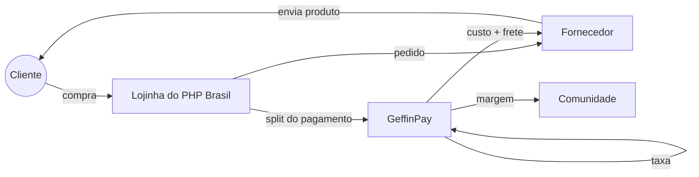

---

## 2. Problema e proposta de valor

### Problemas atuais

| Problema | Impacto |
|---|---|
| Produtos de cada comunidade ficam espalhados (formulários, DMs, pix manual, vendas só em eventos) | Difícil de achar e de comprar |
| Comunidade precisa comprar estoque antes de vender | Risco financeiro e dinheiro parado |
| Voluntários cuidam de embalar, enviar e cobrar | Trabalho operacional e desgaste |
| Pouca transparência sobre o destino do dinheiro | Menos confiança de quem compra |
| Itens de edição de evento (PHPeste) só vendidos no local | Quem não foi fica sem o item |

### Proposta de valor por ator

| Ator | Valor entregue |
|---|---|
| **Cliente / membro da comunidade** | Um lugar único e confiável, preços acessíveis, frete calculado na hora, rastreio, e a certeza de que apoia a comunidade |
| **Comunidade (lojista)** | Loja pronta sem estoque, sem operação logística, recebimento automático e financeiro separado para investir em eventos |
| **Fornecedor** | Canal de vendas recorrente, pedidos organizados em painel próprio, recebimento automático no split |
| **Ecossistema PHP BR** | Fortalece a marca das comunidades, financia eventos e aumenta a visibilidade do PHPeste e dos meetups |

---

## 3. Envolvidos (atores)

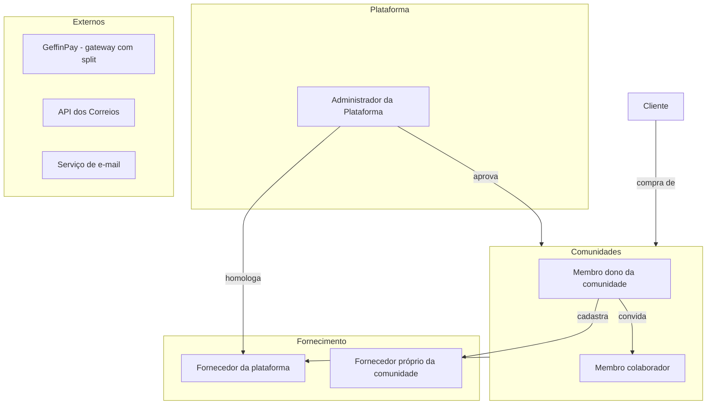

| Ator | Descrição | Principais ações |
|---|---|---|
| **Cliente** | Pessoa que compra na loja | Navegar, montar carrinho, calcular frete, pagar, acompanhar pedido |
| **Administrador da plataforma** | Mantenedores da Lojinha | Aprovar comunidades, homologar fornecedores globais, moderar produtos, mediar disputas |
| **Comunidade (lojista)** | Ex.: PHP Brasil, PHPeste, PHP-SP, PHP-PE… | Cadastrar produtos, fornecedores e margens, ver vendas e financeiro |
| **Membro da comunidade** | Pessoa com acesso ao painel da comunidade (N por comunidade) | Papéis: **Dono** (tudo, incluindo financeiro e membros) e **Colaborador** (produtos e pedidos) |
| **Fornecedor** | Gráfica, fábrica de canecas, artesão do elePHPant etc. | Receber pedidos, atualizar status, informar rastreio, manter preço de custo e prazo de produção |
| **Fornecedor da plataforma** | Fornecedor homologado pelo admin e disponível para **todas** as comunidades | Mesmas ações de fornecedor |
| **Fornecedor próprio** | Cadastrado por uma comunidade e visível **só para ela** | Mesmas ações de fornecedor |
| **GeffinPay** | Gateway de pagamento com split | Cobrar o cliente, dividir o valor e repassar para cada recebedor |
| **Correios** | API de cotação de frete e rastreio | Calcular preço e prazo, fornecer eventos de rastreio |

---

## 4. Business Model Canvas

| Bloco | Conteúdo |
|---|---|
| **Segmentos de clientes** | Devs PHP e entusiastas; participantes de eventos (PHPeste etc.); empresas que patrocinam ou presenteiam times; colecionadores de elePHPants |
| **Proposta de valor** | Todos os produtos oficiais das comunidades em um só lugar, com preço acessível e dinheiro revertido para a própria comunidade |
| **Canais** | Site da Lojinha; divulgação nas comunidades (Telegram, Discord, redes sociais); QR code em eventos e meetups; links por comunidade (`/c/phpeste`) |
| **Relacionamento** | Comunitário e transparente: página da comunidade mostrando para onde vai o dinheiro; notificações de pedido por e-mail |
| **Fontes de receita** | Margem da comunidade sobre o custo do fornecedor. *(Em aberto: pequena taxa da plataforma para cobrir infra; ver §13)* |
| **Recursos-chave** | Plataforma (código aberto?), integração GeffinPay (split), integração Correios, rede de fornecedores homologados, voluntários mantenedores |
| **Atividades-chave** | Manter a plataforma; homologar fornecedores; apoiar comunidades a subir produtos; mediar problemas de entrega |
| **Parcerias-chave** | Fornecedores (gráficas, canecas, pelúcias); GeffinPay; Correios; organizações dos eventos |
| **Estrutura de custos** | Hospedagem e domínio; taxas do gateway (por transação); envio de e-mails; tempo de voluntários; eventual contrato com os Correios |

---

## 5. Como o dinheiro circula (split)

### Composição do preço

```
Preço de venda do produto = Custo do fornecedor + Margem da comunidade
Total do pedido           = Σ (Preço de venda × qtd) + Σ Frete por fornecedor
```

### Regra de divisão proposta *(a validar)*

| Recebedor | Recebe |
|---|---|
| **Fornecedor** | Custo dos itens + frete cobrado (é ele quem posta) |
| **Comunidade** | Margem dos itens − taxa do gateway (proporcional) |
| **GeffinPay** | Taxa da transação |
| **Plataforma** *(opcional)* | % fixa para manutenção, se aprovado pela comunidade |

> A proposta desconta a taxa do gateway da margem da comunidade para que o fornecedor receba **sempre o valor cheio** que informou. Assim o preço de custo fica previsível para ele.

### Exemplo numérico *(valores ilustrativos, taxa fictícia de 3,99% + R$ 0,49)*

| Item | Valor |
|---|---|
| Camisa PHPeste 2026 — custo fornecedor | R$ 45,00 |
| Margem da comunidade PHPeste | R$ 25,00 |
| **Preço de venda** | **R$ 70,00** |
| Frete PAC (cotação Correios) | R$ 22,00 |
| **Total pago pelo cliente** | **R$ 92,00** |

| Split | Cálculo | Valor |
|---|---|---|
| GeffinPay | 92,00 × 3,99% + 0,49 | R$ 4,16 |
| Fornecedor | 45,00 + 22,00 | R$ 67,00 |
| Comunidade PHPeste | 25,00 − 4,16 | R$ 20,84 |
| **Soma** | | **R$ 92,00** ✅ |

### Carrinho com várias comunidades e fornecedores

Um único checkout pode ter itens de comunidades e fornecedores diferentes. O pedido é quebrado em **sub-pedidos por fornecedor** (cada um tem origem, frete e rastreio próprios), e o split tem **um recebedor por comunidade e por fornecedor envolvido**.

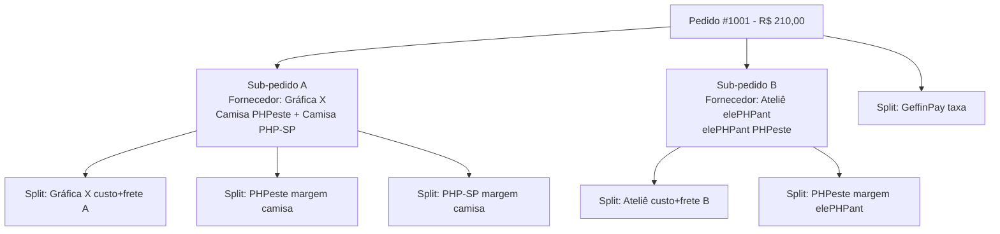

---

## 6. Regras de negócio

### Comunidades e membros
- **RN01** — Comunidade só vende após aprovação do administrador da plataforma.
- **RN02** — Comunidade precisa de conta recebedora (subconta) ativa na GeffinPay para publicar produtos.
- **RN03** — Uma comunidade tem **1 ou mais membros**; ao menos um com papel **Dono**.
- **RN04** — Só **Dono** vê o financeiro, altera dados bancários e gerencia membros.
- **RN05** — Um usuário pode ser membro de mais de uma comunidade.

### Fornecedores
- **RN06** — Fornecedor pode ser **da plataforma** (homologado pelo admin, visível para todas as comunidades) ou **próprio** (cadastrado pela comunidade, visível só para ela).
- **RN07** — Fornecedor precisa de subconta GeffinPay ativa e **CEP de origem** para cálculo de frete.
- **RN08** — Fornecedor mantém: preço de custo por variação (tamanho/cor), prazo de produção (dias) e dimensões/peso de envio.
- **RN09** — Se o fornecedor alterar o custo, os produtos afetados ficam **pendentes de revisão** pela comunidade (a margem não pode ficar negativa sem ninguém perceber).

### Produtos
- **RN10** — Produto pertence a **uma comunidade** e a **um fornecedor**.
- **RN11** — Preço de venda = custo do fornecedor + margem da comunidade (valor fixo ou %).
- **RN12** — Produto pode pertencer a uma **Coleção/Edição** (ex.: *PHPeste 2026*) com data de início e fim de venda e **tiragem limitada** opcional.
- **RN13** — Produtos de edição encerrada saem da vitrine, mas continuam no histórico.

### Pedido, frete e pagamento
- **RN14** — Frete calculado **por sub-pedido** (CEP origem do fornecedor → CEP do cliente), usando peso e dimensões somados dos itens.
- **RN15** — Prazo exibido ao cliente = prazo de produção do fornecedor + prazo dos Correios.
- **RN16** — Pedido só é enviado ao fornecedor **após pagamento confirmado** (webhook da GeffinPay).
- **RN17** — Fornecedor tem **X dias úteis** (a definir) para informar o código de rastreio; se não informar, o pedido é sinalizado ao admin e à comunidade.
- **RN18** — Cancelamento antes da produção gera estorno total; depois da produção, segue a política da comunidade e o CDC (direito de arrependimento de 7 dias para compras online).

---

## 7. Diagramas de fluxo

### 7.1 Onboarding da comunidade

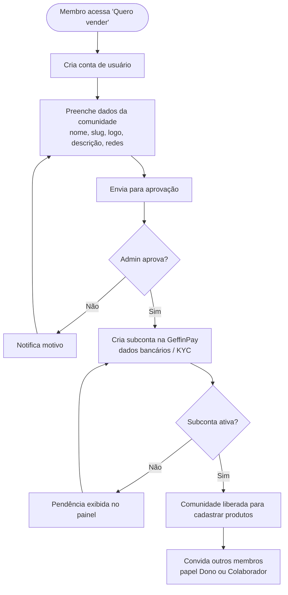

### 7.2 Cadastro de fornecedor


### 7.3 Cadastro de produto

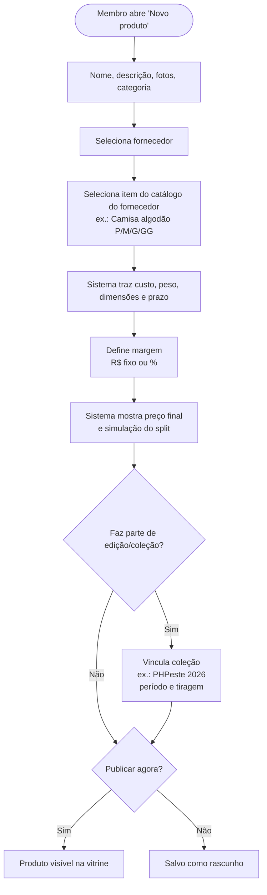

### 7.4 Jornada de compra

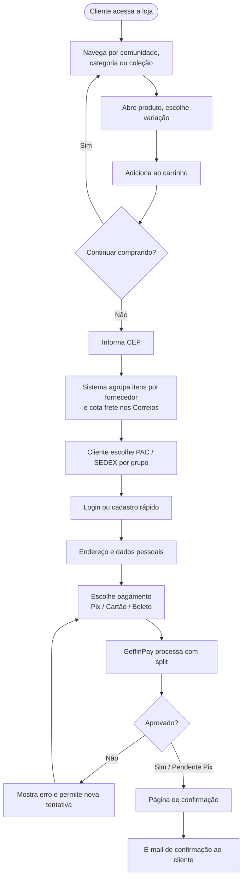

### 7.5 Atendimento do pedido pelo fornecedor

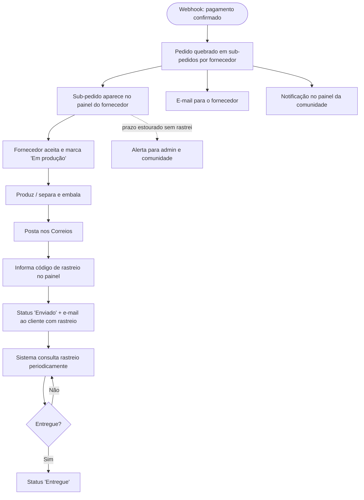

### 7.6 Cancelamento e estorno

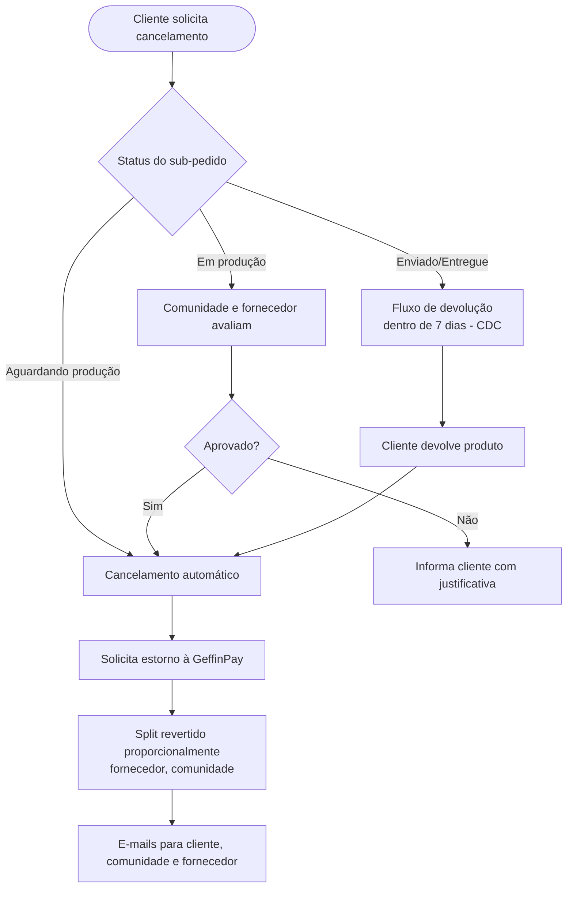

---

## 8. Diagramas de sequência

### 8.1 Cálculo de frete no carrinho


### 8.2 Checkout e pagamento com split

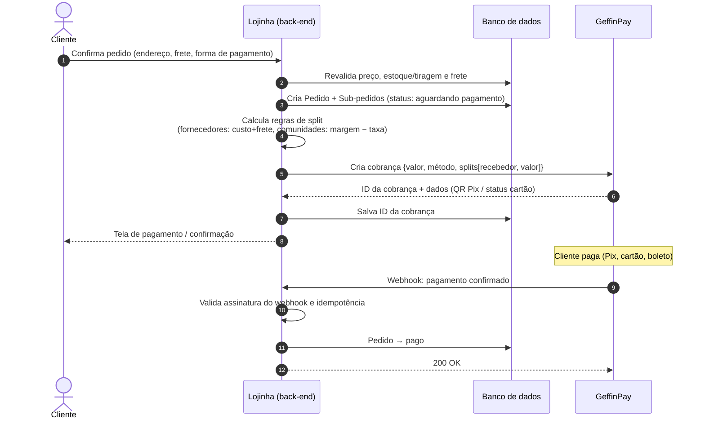

### 8.3 Notificação e atendimento pelo fornecedor

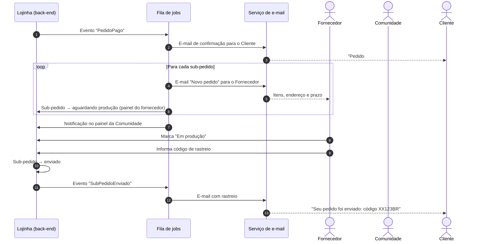

### 8.4 Acompanhamento de rastreio

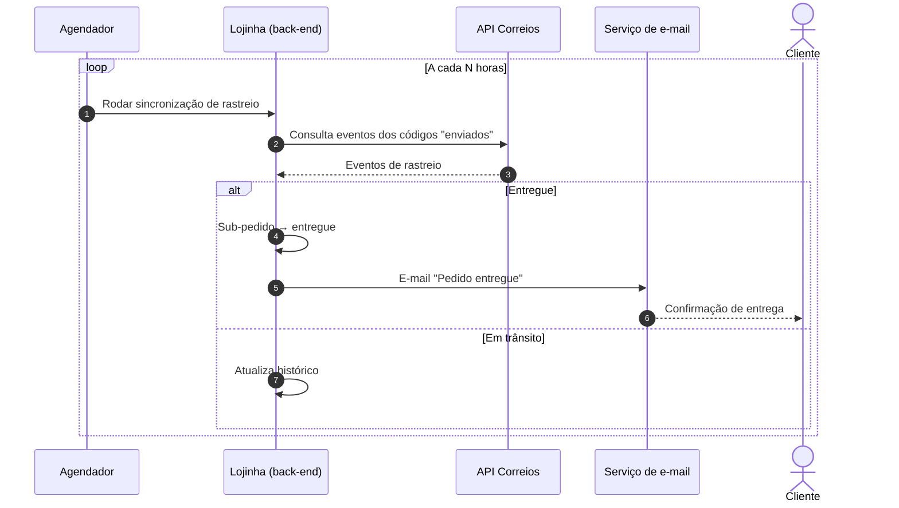

### 8.5 Estorno

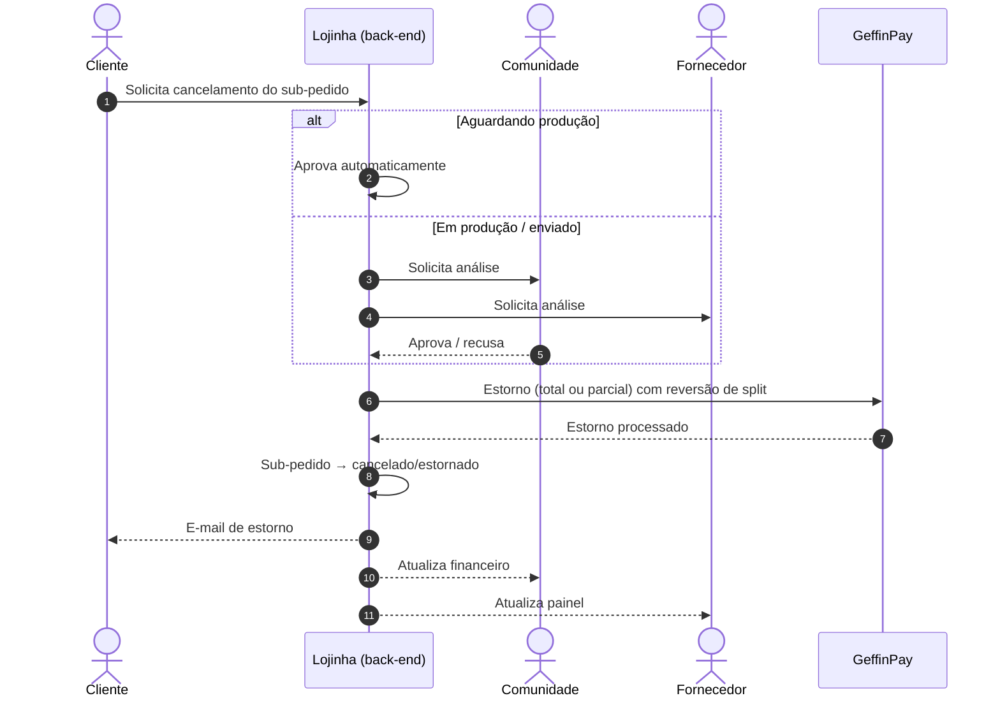

---

## 9. Ciclo de vida do pedido

Status aplicado a cada **sub-pedido** (um por fornecedor). O pedido geral mostra o status agregado.

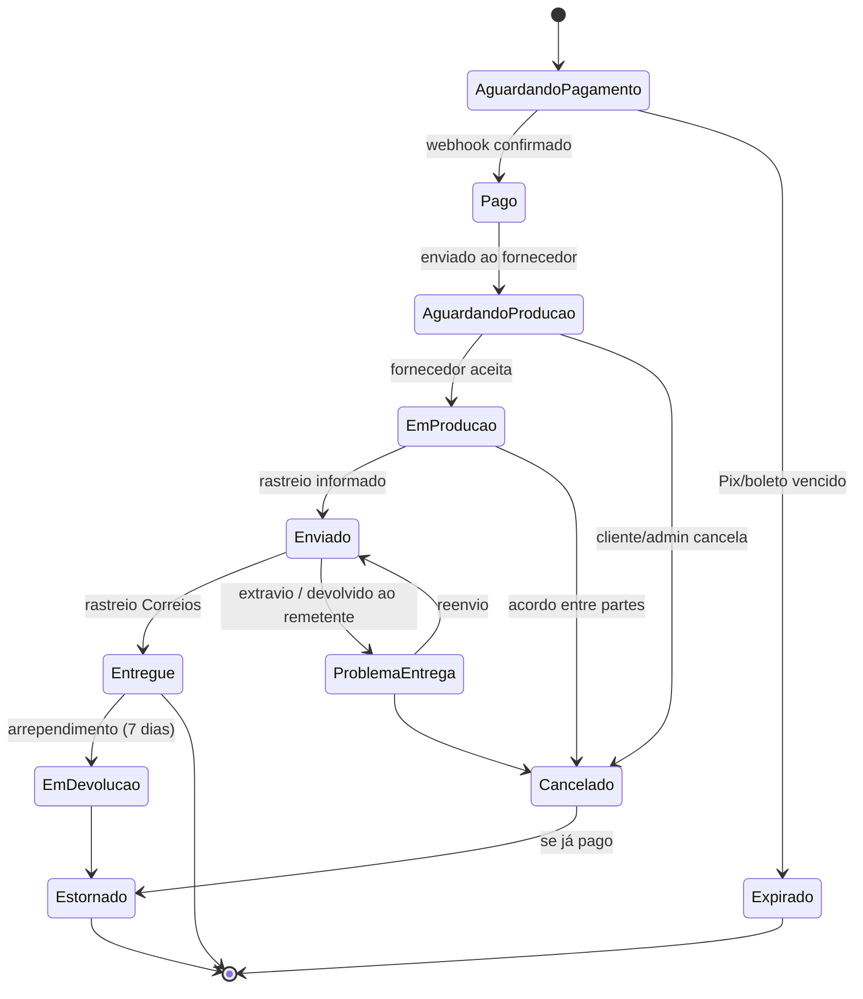

---

## 10. Modelo de dados (conceitual)

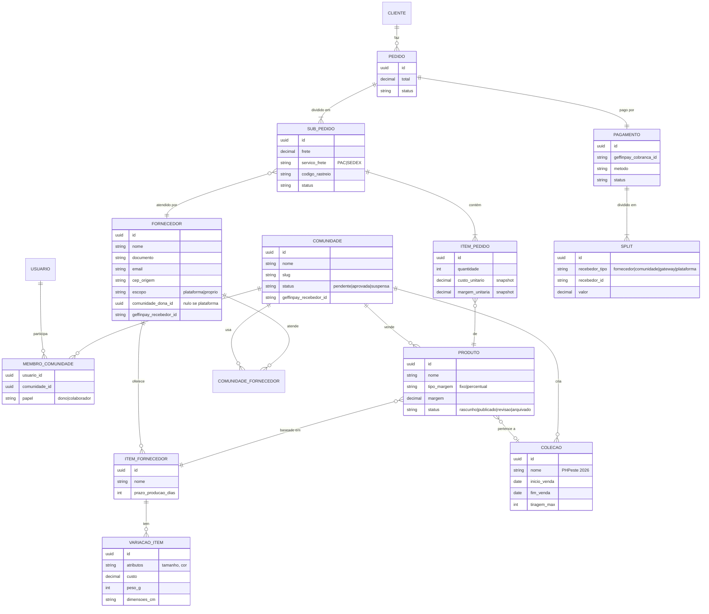

> **Importante:** custo e margem são gravados como *snapshot* no `ITEM_PEDIDO`. Mudanças futuras de preço não alteram pedidos já feitos nem o split deles.

---

## 11. Telas envolvidas

### 11.1 Inventário de telas

| # | Área | Tela | Ator | Principais elementos |
|---|---|---|---|---|
| L01 | Loja | Home | Cliente | Destaques, coleções ativas (PHPeste 2026), comunidades, mais vendidos |
| L02 | Loja | Página da comunidade | Cliente | Logo, descrição, "para onde vai o dinheiro", produtos |
| L03 | Loja | Listagem / busca | Cliente | Filtros por comunidade, categoria, coleção, preço |
| L04 | Loja | Página de coleção/edição | Cliente | Banner do evento, contagem regressiva, tiragem restante |
| L05 | Loja | Detalhe do produto | Cliente | Fotos, variações, preço, simulador de frete, prazo, "X% vai para a comunidade" |
| L06 | Loja | Carrinho | Cliente | Itens agrupados por envio, CEP, escolha de frete por grupo |
| L07 | Loja | Checkout — identificação/endereço | Cliente | Login/cadastro rápido, endereço (autocompletar via CEP) |
| L08 | Loja | Checkout — pagamento | Cliente | Pix, cartão, boleto; resumo |
| L09 | Loja | Confirmação | Cliente | Número do pedido, QR Pix, próximos passos |
| L10 | Loja | Minha conta — pedidos | Cliente | Lista, status por envio, rastreio, cancelar/devolver |
| C01 | Painel Comunidade | Onboarding / cadastro | Membro | Dados da comunidade, status de aprovação, subconta GeffinPay |
| C02 | Painel Comunidade | Dashboard | Membro | Vendas do período, pedidos pendentes, alertas (custo alterado, atraso) |
| C03 | Painel Comunidade | Produtos (lista) | Membro | Status, preço, margem, fornecedor |
| C04 | Painel Comunidade | Produto (form) | Membro | Dados, fornecedor, variações, margem, simulação de split |
| C05 | Painel Comunidade | Coleções / edições | Membro | Período, tiragem, produtos vinculados |
| C06 | Painel Comunidade | Fornecedores | Membro | Da plataforma (catálogo) e próprios; convidar fornecedor |
| C07 | Painel Comunidade | Pedidos | Membro | Pedidos com itens da comunidade, status, rastreio |
| C08 | Painel Comunidade | Financeiro | Dono | Recebido, a receber, estornos, extrato por pedido |
| C09 | Painel Comunidade | Membros | Dono | Convidar, papéis, remover |
| C10 | Painel Comunidade | Configurações | Dono | Perfil público, dados bancários (GeffinPay), política de troca |
| F01 | Painel Fornecedor | Onboarding | Fornecedor | Aceitar convite, dados, CEP origem, subconta GeffinPay |
| F02 | Painel Fornecedor | Dashboard | Fornecedor | Novos pedidos, em produção, atrasados |
| F03 | Painel Fornecedor | Catálogo de itens | Fornecedor | Itens, variações, custo, peso/dimensões, prazo de produção |
| F04 | Painel Fornecedor | Pedidos (lista) | Fornecedor | Filtro por status, comunidade, prazo |
| F05 | Painel Fornecedor | Pedido (detalhe) | Fornecedor | Itens com arte/estampa, endereço, etiqueta, informar rastreio |
| F06 | Painel Fornecedor | Financeiro | Fornecedor | Recebido, a receber, por comunidade |
| A01 | Admin | Dashboard | Admin | GMV, pedidos, comunidades ativas, alertas |
| A02 | Admin | Comunidades | Admin | Aprovar, suspender |
| A03 | Admin | Fornecedores da plataforma | Admin | Homologar, suspender |
| A04 | Admin | Pedidos e disputas | Admin | Busca global, mediação, estornos |
| A05 | Admin | Configurações | Admin | Taxas, prazos (RN17), integrações |
| E01 | E-mail | Pedido confirmado | Cliente | |
| E02 | E-mail | Novo pedido | Fornecedor | |
| E03 | E-mail | Pedido enviado (rastreio) | Cliente | |
| E04 | E-mail | Pedido entregue | Cliente | |
| E05 | E-mail | Estorno | Cliente, Comunidade, Fornecedor | |
| E06 | E-mail | Convite | Membro, Fornecedor | |
| E07 | E-mail | Alerta de atraso | Comunidade, Admin | |

### 11.2 Wireframes de baixa fidelidade

**L01 — Home**
```
┌────────────────────────────────────────────────────────────┐
│ 🐘 Lojinha do PHP Brasil   [ buscar...        ] 👤  🛒(2)  │
├────────────────────────────────────────────────────────────┤
│  ╔══════════════════════════════════════════════════════╗  │
│  ║  PHPeste 2026 — itens exclusivos da edição           ║  │
│  ║  Vendas até 30/11 · tiragem limitada   [Ver coleção] ║  │
│  ╚══════════════════════════════════════════════════════╝  │
│                                                            │
│  Comunidades                                               │
│  (PHP BR) (PHPeste) (PHP-SP) (PHP-PE) (PHP-RS)  [ver todas]│
│                                                            │
│  Mais vendidos                                             │
│  ┌────────┐ ┌────────┐ ┌────────┐ ┌────────┐               │
│  │ [img]  │ │ [img]  │ │ [img]  │ │ [img]  │               │
│  │Camisa  │ │Caneca  │ │elePHP  │ │Camisa  │               │
│  │PHPeste │ │PHP BR  │ │PHP-SP  │ │PHP-PE  │               │
│  │R$ 70   │ │R$ 45   │ │R$ 120  │ │R$ 65   │               │
│  └────────┘ └────────┘ └────────┘ └────────┘               │
└────────────────────────────────────────────────────────────┘
```

**L05 — Detalhe do produto**
```
┌────────────────────────────────────────────────────────────┐
│ ← PHPeste / Camisas                                        │
│ ┌──────────────────┐  Camisa Oficial PHPeste 2026          │
│ │                  │  por Comunidade PHPeste               │
│ │      [foto]      │                                       │
│ │                  │  R$ 70,00                             │
│ └──────────────────┘  💚 R$ 25,00 apoiam a comunidade      │
│ [▫][▫][▫]                                                  │
│                       Tamanho: (P) (M) (G) (GG)            │
│                       Qtd: [- 1 +]                         │
│                                                            │
│                       Calcular frete: [00000-000] [OK]     │
│                        PAC   R$ 22,00 · até 12 dias úteis  │
│                        SEDEX R$ 38,00 · até 8 dias úteis   │
│                        (inclui 5 dias de produção)         │
│                                                            │
│                       [   Adicionar ao carrinho   ]        │
│  Edição limitada: restam 47 de 200                         │
└────────────────────────────────────────────────────────────┘
```

**L06 — Carrinho (agrupado por envio)**
```
┌────────────────────────────────────────────────────────────┐
│ Seu carrinho                          CEP: [50000-000] [OK]│
├────────────────────────────────────────────────────────────┤
│ 📦 Envio 1 — sai de Recife/PE                              │
│   Camisa PHPeste 2026 (M) x1 ............... R$  70,00     │
│   Camisa PHP-SP (G) x1 ..................... R$  65,00     │
│   Frete: (•) PAC R$ 24,00 12d  ( ) SEDEX R$ 41,00 7d       │
├────────────────────────────────────────────────────────────┤
│ 📦 Envio 2 — sai de São Paulo/SP                           │
│   elePHPant PHPeste x1 ..................... R$ 120,00     │
│   Frete: (•) PAC R$ 28,00 15d  ( ) SEDEX R$ 52,00 9d       │
├────────────────────────────────────────────────────────────┤
│ Subtotal R$ 255,00 · Frete R$ 52,00 · Total R$ 307,00      │
│ 💚 R$ 85,00 vão para as comunidades                        │
│                                  [ Finalizar compra → ]    │
└────────────────────────────────────────────────────────────┘
```

**C04 — Formulário de produto (painel da comunidade)**
```
┌────────────────────────────────────────────────────────────┐
│ PHPeste ▾ │ Produtos › Novo produto                        │
├───────────┼────────────────────────────────────────────────┤
│ Dashboard │ Nome: [Camisa Oficial PHPeste 2026        ]    │
│ Produtos  │ Fotos: [+ upload]                              │
│ Coleções  │ Fornecedor: [Gráfica X (plataforma)      ▾]    │
│ Fornecedor│ Item base:  [Camisa algodão 30.1         ▾]    │
│ Pedidos   │                                                │
│ Financeiro│ Variação │ Custo  │ Margem   │ Preço final     │
│ Membros   │ P        │ 45,00  │ [25,00]  │ 70,00           │
│ Config.   │ M        │ 45,00  │ [25,00]  │ 70,00           │
│           │ GG       │ 49,00  │ [25,00]  │ 74,00           │
│           │                                                │
│           │ Margem: (•) R$ fixo  ( ) %                     │
│           │ Coleção: [PHPeste 2026 ▾]  Tiragem: [200]      │
│           │                                                │
│           │ Simulação do split (camisa M, sem frete):      │
│           │  Fornecedor R$ 45,00 · Comunidade ~R$ 22,00    │
│           │  Gateway ~R$ 3,00                              │
│           │                                                │
│           │ [Salvar rascunho]  [Publicar]                  │
└───────────┴────────────────────────────────────────────────┘
```

**C08 — Financeiro da comunidade**
```
┌────────────────────────────────────────────────────────────┐
│ PHPeste ▾ │ Financeiro                   Período: [Set/26▾]│
├───────────┼────────────────────────────────────────────────┤
│           │ ┌──────────┐ ┌──────────┐ ┌──────────┐         │
│           │ │Recebido  │ │A receber │ │Estornos  │         │
│           │ │R$ 3.420  │ │R$ 1.180  │ │R$ 70     │         │
│           │ └──────────┘ └──────────┘ └──────────┘         │
│           │                                                │
│           │ Pedido │ Data  │ Bruto  │ Taxa  │ Líquido │ St │
│           │ #1001  │ 20/09 │ 25,00  │ 4,16  │ 20,84   │ ✅ │
│           │ #1002  │ 21/09 │ 50,00  │ 5,10  │ 44,90   │ ⏳ │
│           │ ...                                            │
│           │                              [Exportar CSV]    │
└───────────┴────────────────────────────────────────────────┘
```

**F05 — Detalhe do pedido (painel do fornecedor)**
```
┌────────────────────────────────────────────────────────────┐
│ Gráfica X │ Pedidos › #1001-A        Status: Em produção   │
├───────────┼────────────────────────────────────────────────┤
│           │ Prazo para postagem: 27/09 (faltam 3 dias)     │
│           │                                                │
│           │ Itens                                          │
│           │  Camisa PHPeste 2026 · M · x1  [baixar arte]   │
│           │  Camisa PHP-SP · G · x1        [baixar arte]   │
│           │                                                │
│           │ Entregar para                                  │
│           │  Fulana de Tal · Rua X, 123 · Recife/PE        │
│           │  CEP 50000-000                                 │
│           │  Serviço: PAC                                  │
│           │                                                │
│           │ Você recebe: R$ 134,00 (custo 110 + frete 24)  │
│           │                                                │
│           │ Código de rastreio: [____________] [Enviar]    │
└───────────┴────────────────────────────────────────────────┘
```

---

## 12. Mapa de navegação

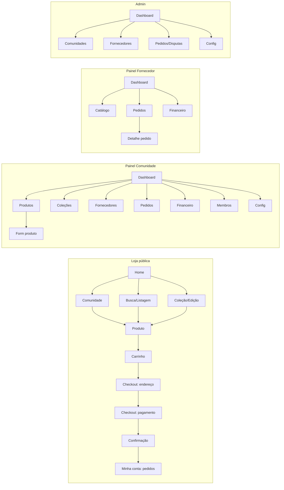

---

## 13. Riscos e pontos em aberto

| # | Tema | Pergunta / risco | Sugestão inicial |
|---|---|---|---|
| Q1 | **Taxa do gateway** | Quem absorve a taxa: comunidade, fornecedor ou rateio? | Descontar da margem da comunidade (§5) |
| Q2 | **Sustentabilidade da plataforma** | Quem paga hospedagem e manutenção? | Taxa pequena (ex.: 1–3%) ou apoio/patrocínio; decidir com a comunidade |
| Q3 | **GeffinPay** | Suporta split com N recebedores, estorno parcial com reversão de split e subcontas para PF? | Validar a API antes de fechar a arquitetura |
| Q4 | **API dos Correios** | A API oficial (CWS) exige contrato; cada fornecedor tem o seu? | Cotação com contrato da plataforma ou dos fornecedores; avaliar agregadores (Melhor Envio etc.) como alternativa |
| Q5 | **Responsabilidade legal** | Quem emite nota fiscal? Comunidades sem CNPJ podem vender? | Fornecedor emite NF da venda do produto; comunidade recebe a margem como intermediação/doação. **Validar com contador** |
| Q6 | **Chargeback** | Quem arca com contestação de cartão? | Definir regra no termo de uso; possível reserva/retensão da comunidade |
| Q7 | **Atraso/extravio** | Fornecedor não envia ou produto se perde | Prazo RN17, alerta, reenvio pelo fornecedor, mediação do admin |
| Q8 | **Qualidade** | Produto ruim afeta a imagem da comunidade | Homologação de fornecedores da plataforma + avaliações de clientes |
| Q9 | **Direitos de marca** | Uso de marcas (PHP, elePHPant) e logos | Cada comunidade responde pelas próprias artes; verificar diretrizes de uso das marcas |
| Q10 | **LGPD** | Fornecedor recebe dados pessoais do cliente (endereço) | Termo de uso + compartilhar só o necessário para entrega |
| Q11 | **Frete com vários itens** | Somar pesos/dimensões pode dar cotação errada | Fornecedor cadastra embalagens padrão; revisar regra de cubagem |

---

## 14. Roadmap sugerido

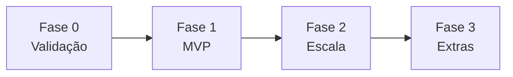

| Fase | Escopo |
|---|---|
| **0 — Validação** | Apresentar este documento à comunidade; responder Q1–Q5; conversar com 2–3 fornecedores e 2–3 comunidades piloto (ex.: PHPeste, PHP BR) |
| **1 — MVP** | Loja (L01–L10), painel comunidade básico (produtos, pedidos, financeiro), painel fornecedor (pedidos + rastreio), split GeffinPay, frete Correios, e-mails E01–E03. Fornecedores cadastrados manualmente pelo admin |
| **2 — Escala** | Autoatendimento de comunidades e fornecedores, múltiplos membros e papéis, coleções/edições com tiragem, estorno pelo painel, rastreio automático |
| **3 — Extras** | Avaliações, cupons, pré-venda de edições, kits (camisa + caneca + elePHPant), relatório público de transparência por comunidade |

---

*Contribuições, críticas e ideias são bem-vindas. Abra uma discussão ou fale com os mantenedores.* 🐘💙
