# Loja das Comunidades Tech BR — Modelo de Negócios

> Documento para discussão com as comunidades de tecnologia do Brasil (piloto: comunidade PHP Brasil).
> Versão 0.2 — 24/09/2026 — **rascunho aberto a contribuições**
> *"Loja das Comunidades Tech BR" é nome provisório.*

**Mudanças da v0.2**
- Escopo ampliado: de loja do PHP Brasil para **loja oficial das comunidades de tecnologia do Brasil** (qualquer stack).
- Nova funcionalidade: cliente pode **acompanhar comunidades** e receber e-mail a cada lançamento (§5, §8.7–8.8, §9.6–9.7).
- **Tabela real de taxas da GeffinPay** e split recalculado por forma de pagamento (§6).

---

## Sumário

1. [Visão geral](#1-visão-geral)
2. [Problema e proposta de valor](#2-problema-e-proposta-de-valor)
3. [Envolvidos (atores)](#3-envolvidos-atores)
4. [Business Model Canvas](#4-business-model-canvas)
5. [Acompanhar comunidades](#5-acompanhar-comunidades)
6. [Como o dinheiro circula (split)](#6-como-o-dinheiro-circula-split)
7. [Regras de negócio](#7-regras-de-negócio)
8. [Diagramas de fluxo](#8-diagramas-de-fluxo)
9. [Diagramas de sequência](#9-diagramas-de-sequência)
10. [Ciclo de vida do pedido](#10-ciclo-de-vida-do-pedido)
11. [Modelo de dados (conceitual)](#11-modelo-de-dados-conceitual)
12. [Telas envolvidas](#12-telas-envolvidas)
13. [Mapa de navegação](#13-mapa-de-navegação)
14. [Riscos e pontos em aberto](#14-riscos-e-pontos-em-aberto)
15. [Roadmap sugerido](#15-roadmap-sugerido)

---

## 1. Visão geral

A **Loja das Comunidades Tech BR** é a **loja oficial das comunidades de tecnologia do Brasil**: um marketplace nichado onde **as comunidades são as lojistas**. PHP, Python, JavaScript, Java, Go, Ruby, .NET, dados, DevOps, grupos de mulheres na tecnologia, comunidades regionais: qualquer comunidade aprovada pode vender. Em um só lugar, qualquer pessoa encontra:

- 👕 Camisas oficiais das comunidades
- ☕ Canecas
- 🧸 Os **mascotes caracterizados** de cada comunidade (ex.: o elePHPant da comunidade PHP)
- 🎟️ Itens **exclusivos de cada edição de evento** (ex.: PHPeste e outros eventos das comunidades)

Cada comunidade cadastra seus produtos, escolhe fornecedores, define sua margem e tem **financeiro próprio**, e pode usar o que arrecadar para **financiar suas operações e eventos**: meetups, bolsas, infraestrutura etc.

O cliente pode **acompanhar** as comunidades de que gosta e recebe um e-mail sempre que alguma delas lança algo novo.

A comunidade **PHP Brasil** é a comunidade piloto. Os exemplos deste documento usam comunidades PHP, mas as regras valem para qualquer comunidade.

A operação segue um modelo **parecido com dropshipping**:

- a comunidade **não mantém estoque** e não faz envios;
- o **fornecedor** produz ou separa o item e envia direto ao cliente;
- o pagamento é dividido automaticamente (**split**) entre **gateway (GeffinPay)**, **comunidade** e **fornecedor**;
- o frete é calculado pela **API dos Correios**.

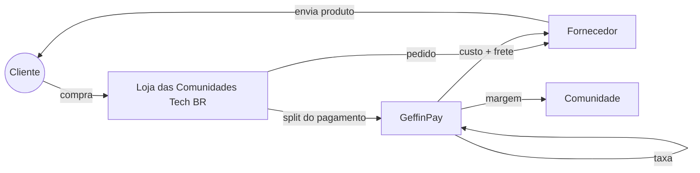

---

## 2. Problema e proposta de valor

### Problemas atuais

| Problema | Impacto |
|---|---|
| Produtos de cada comunidade ficam espalhados (formulários, DMs, pix manual, vendas só em eventos) | Difícil de achar e de comprar |
| Comunidade precisa comprar estoque antes de vender | Risco financeiro e dinheiro parado |
| Voluntários cuidam de embalar, enviar e cobrar | Trabalho operacional e desgaste |
| Pouca transparência sobre o destino do dinheiro | Menos confiança de quem compra |
| Itens de edição de evento (ex.: PHPeste) só vendidos no local | Quem não foi fica sem o item |
| Fã de uma comunidade não fica sabendo quando sai produto novo | Venda perdida; lançamento depende de post em rede social |
| Cada comunidade reinventa a própria loja | Esforço repetido em todo o ecossistema |

### Proposta de valor por ator

| Ator | Valor entregue |
|---|---|
| **Cliente / membro da comunidade** | Um lugar único e confiável, preços acessíveis, frete calculado na hora, rastreio, a certeza de que apoia a comunidade e aviso de lançamentos das comunidades que acompanha |
| **Comunidade (lojista)** | Loja pronta sem estoque, sem operação logística, recebimento automático, financeiro separado para investir em eventos e público de seguidores avisado a cada lançamento |
| **Fornecedor** | Canal de vendas recorrente com várias comunidades, pedidos organizados em painel próprio, recebimento automático no split |
| **Ecossistema tech BR** | Fortalece a marca das comunidades, financia eventos, aumenta a visibilidade dos meetups e aproxima comunidades de stacks diferentes |

---

## 3. Envolvidos (atores)

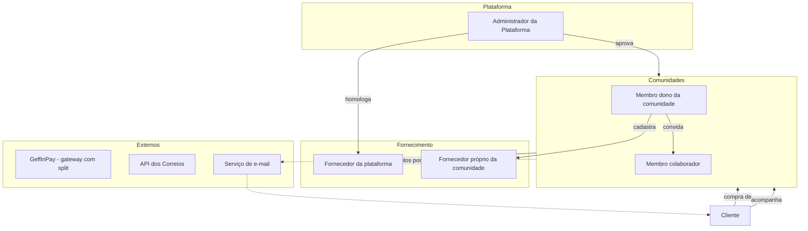

| Ator | Descrição | Principais ações |
|---|---|---|
| **Cliente** | Pessoa que compra na loja | Navegar, montar carrinho, calcular frete, pagar, acompanhar pedido, **acompanhar comunidades** |
| **Administrador da plataforma** | Mantenedores da Loja | Aprovar comunidades, homologar fornecedores globais, moderar produtos, mediar disputas, manter tabela de taxas |
| **Comunidade (lojista)** | Qualquer comunidade de tecnologia aprovada. Ex.: PHP Brasil, PHPeste, grupos de Python, JS, Java, dados, DevOps… | Cadastrar produtos, coleções, fornecedores e margens, ver vendas, financeiro e nº de seguidores |
| **Membro da comunidade** | Pessoa com acesso ao painel da comunidade (N por comunidade) | Papéis: **Dono** (tudo, incluindo financeiro e membros) e **Colaborador** (produtos e pedidos) |
| **Fornecedor** | Gráfica, fábrica de canecas, ateliê de mascotes/pelúcias etc. | Receber pedidos, atualizar status, informar rastreio, manter preço de custo e prazo de produção |
| **Fornecedor da plataforma** | Fornecedor homologado pelo admin e disponível para **todas** as comunidades | Mesmas ações de fornecedor |
| **Fornecedor próprio** | Cadastrado por uma comunidade e visível **só para ela** | Mesmas ações de fornecedor |
| **GeffinPay** | Gateway de pagamento com split | Cobrar o cliente, dividir o valor e repassar para cada recebedor |
| **Correios** | API de cotação de frete e rastreio | Calcular preço e prazo, fornecer eventos de rastreio |

---

## 4. Business Model Canvas

| Bloco | Conteúdo |
|---|---|
| **Segmentos de clientes** | Pessoas desenvolvedoras e entusiastas de qualquer stack; participantes de eventos; empresas que patrocinam ou presenteiam times; colecionadores de mascotes (elePHPant etc.) |
| **Proposta de valor** | Todos os produtos oficiais das comunidades de tecnologia do Brasil em um só lugar, com preço acessível e dinheiro revertido para a própria comunidade |
| **Canais** | Site da Loja; divulgação nas comunidades (Telegram, Discord, redes sociais); QR code em eventos e meetups; links por comunidade (`/c/phpeste`); **e-mail de lançamento para seguidores** |
| **Relacionamento** | Comunitário e transparente: página da comunidade mostrando para onde vai o dinheiro; **acompanhar comunidades**; notificações de pedido e de lançamentos por e-mail |
| **Fontes de receita** | Margem da comunidade sobre o custo do fornecedor. *(Em aberto: pequena taxa da plataforma para cobrir infra; ver §14)* |
| **Recursos-chave** | Plataforma (código aberto?), integração GeffinPay (split), integração Correios, rede de fornecedores homologados, voluntários mantenedores |
| **Atividades-chave** | Manter a plataforma; homologar fornecedores; apoiar comunidades a subir produtos; mediar problemas de entrega |
| **Parcerias-chave** | Fornecedores (gráficas, canecas, pelúcias); GeffinPay; Correios; organizações dos eventos |
| **Estrutura de custos** | Hospedagem e domínio; taxas do gateway (por transação, ver §6); envio de e-mails (cresce com o nº de seguidores); tempo de voluntários; eventual contrato com os Correios |

---

## 5. Acompanhar comunidades

O cliente pode **acompanhar quantas comunidades quiser**. Sempre que uma comunidade acompanhada **publicar algo novo**, o cliente recebe um **e-mail** sobre o lançamento.

### Eventos que geram notificação

A funcionalidade é pensada como **eventos de lançamento da comunidade**. Hoje são dois tipos, e novos tipos entram sem mudar o mecanismo:

| Evento | Quando dispara | Conteúdo do e-mail |
|---|---|---|
| `produto_publicado` | Produto passa de rascunho para **publicado** (não dispara em edição de produto já publicado) | Foto, nome, preço, link do produto |
| `colecao_publicada` | Coleção/edição é publicada (ex.: *PHPeste 2026*) | Banner, período de venda, tiragem, produtos da coleção |
| *futuro:* `pre_venda_aberta`, `produto_reposto`, `evento_anunciado`, `cupom_criado`… | Definido quando a funcionalidade existir | Modelo de e-mail próprio |

### Como funciona

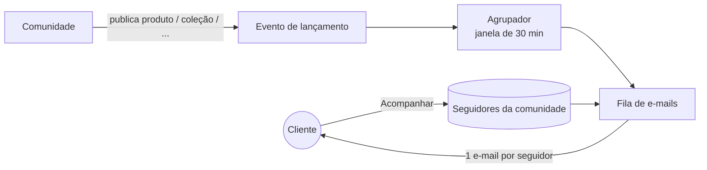

- **Agrupamento:** se a comunidade publicar vários produtos de uma vez (ex.: 8 camisas de uma coleção), o seguidor recebe **um e-mail** com todos os lançamentos, e não 8 e-mails. Os eventos da mesma comunidade são agrupados numa janela curta (sugestão: 30 min, configurável).
- **Preferências:** o cliente escolhe na conta quais tipos de lançamento quer receber e pode pausar todos.
- **Descadastro em 1 clique:** todo e-mail tem link para deixar de acompanhar aquela comunidade ou parar todos os e-mails de lançamento (LGPD e boas práticas antispam).
- **Quem pode acompanhar:** só cliente logado com e-mail confirmado (evita spam para e-mails de terceiros).
- **Para a comunidade:** o painel mostra o número de seguidores e quantos e-mails cada lançamento gerou. A comunidade **não** vê os e-mails dos seguidores.

---

## 6. Como o dinheiro circula (split)

### Composição do preço

```
Preço de venda do produto = Custo do fornecedor + Margem da comunidade
Total do pedido           = Σ (Preço de venda × qtd) + Σ Frete por fornecedor
```

### Tabela de taxas da GeffinPay

| Forma de pagamento | Taxa | Tipo |
|---|---|---|
| **Pix** | R$ 2,49 | Fixa por transação |
| **Boleto** | R$ 2,49 | Fixa por transação |
| **Crédito à vista** | R$ 0,49 + 3,99% | Fixa + percentual sobre o total |
| **Crédito parcelado (2x a 6x)** | R$ 0,49 + 4,49% | Fixa + percentual sobre o total |

- Pix e boleto têm **taxa fixa em centavos**, não importa o valor do pedido. Só o cartão de crédito tem parte percentual.
- Parcelamento **máximo de 6x**. O parcelamento é **sem juros para o cliente**: a diferença de taxa é absorvida (ver regra abaixo).
- A taxa é cobrada **uma vez por pedido** (uma transação), mesmo com várias comunidades e fornecedores no carrinho.
- A tabela fica **configurável no admin com data de vigência**, e cada pagamento guarda a taxa aplicada (*snapshot*). Se a GeffinPay mudar os preços, pedidos antigos não mudam.

**Fórmulas** (arredondamento em centavos, meio para cima):

```
Pix / Boleto         taxa = 2,49
Crédito à vista      taxa = 0,49 + arred(total × 3,99%)
Crédito 2x a 6x      taxa = 0,49 + arred(total × 4,49%)
```

### Regra de divisão proposta *(a validar)*

| Recebedor | Recebe |
|---|---|
| **Fornecedor** | Custo dos itens + frete cobrado (é ele quem posta) |
| **Comunidade** | Margem dos itens − sua parte da taxa do gateway |
| **GeffinPay** | Taxa da transação (tabela acima) |
| **Plataforma** *(opcional)* | % fixa para manutenção, se aprovado pelas comunidades |

> A proposta desconta a taxa do gateway da margem da comunidade para que o fornecedor receba **sempre o valor cheio** que informou. Assim o preço de custo fica previsível para ele.
>
> ⚠️ No cartão, a parte percentual incide sobre o **total do pedido, incluindo o frete**. A comunidade paga a taxa sobre o valor que vai para o fornecedor também. Isso precisa ficar claro no simulador de margem (tela C04).

**Rateio entre comunidades:** quando o pedido tem itens de mais de uma comunidade, a taxa é dividida **proporcionalmente à margem** de cada uma. Os centavos que sobram do arredondamento vão para a comunidade com a maior margem, para a soma bater exatamente com a taxa.

### Exemplo 1 — um produto, uma comunidade

| Item | Valor |
|---|---|
| Camisa PHPeste 2026 — custo fornecedor | R$ 45,00 |
| Margem da comunidade PHPeste | R$ 25,00 |
| **Preço de venda** | **R$ 70,00** |
| Frete PAC (cotação Correios) | R$ 22,00 |
| **Total pago pelo cliente** | **R$ 92,00** |

| Forma de pagamento | Taxa GeffinPay | Fornecedor | Comunidade | Soma |
|---|---|---|---|---|
| Pix | R$ 2,49 | R$ 67,00 | **R$ 22,51** | R$ 92,00 ✅ |
| Boleto | R$ 2,49 | R$ 67,00 | **R$ 22,51** | R$ 92,00 ✅ |
| Crédito à vista | 0,49 + 3,67 = R$ 4,16 | R$ 67,00 | **R$ 20,84** | R$ 92,00 ✅ |
| Crédito 2x–6x | 0,49 + 4,13 = R$ 4,62 | R$ 67,00 | **R$ 20,38** | R$ 92,00 ✅ |

> Em pedidos pequenos, Pix e boleto ficam mais baratos para a comunidade. Em pedidos maiores, a taxa fixa vale ainda mais a pena: num pedido de R$ 300, o Pix custa R$ 2,49 e o crédito à vista custa R$ 12,46. Vale incentivar o Pix na tela de pagamento.

### Exemplo 2 — carrinho com duas comunidades e dois fornecedores

Carrinho da tela L06: Camisa PHPeste (margem R$ 25) + Camisa PHP-SP (margem R$ 20) + mascote elePHPant PHPeste (margem R$ 40). Total R$ 307,00, sendo R$ 255,00 de produtos e R$ 52,00 de frete. Margens: **PHPeste R$ 65,00** e **PHP-SP R$ 20,00** (soma R$ 85,00).

| Forma | Taxa total | PHPeste (65/85) | PHP-SP (20/85) | PHPeste recebe | PHP-SP recebe |
|---|---|---|---|---|---|
| Pix / Boleto | R$ 2,49 | R$ 1,90 | R$ 0,59 | R$ 63,10 | R$ 19,41 |
| Crédito à vista | 0,49 + 12,25 = R$ 12,74 | R$ 9,74 | R$ 3,00 | R$ 55,26 | R$ 17,00 |
| Crédito 2x–6x | 0,49 + 13,78 = R$ 14,27 | R$ 10,91 | R$ 3,36 | R$ 54,09 | R$ 16,64 |

Os fornecedores recebem o mesmo valor em qualquer forma de pagamento (custo + frete de cada envio).

### Carrinho com várias comunidades e fornecedores

Um único checkout pode ter itens de comunidades e fornecedores diferentes. O pedido é quebrado em **sub-pedidos por fornecedor** (cada um tem origem, frete e rastreio próprios), e o split tem **um recebedor por comunidade e por fornecedor envolvido**.

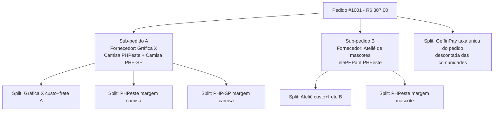

---

## 7. Regras de negócio

### Comunidades e membros
- **RN01** — Comunidade só vende após aprovação do administrador da plataforma. Critério sugerido: ser comunidade de tecnologia brasileira, sem fins lucrativos, com atividade pública recente (meetups, eventos, grupo ativo) e responsáveis identificados.
- **RN01a** — Comunidade informa as **tecnologias/temas** (ex.: PHP, Python, dados) e a **região**, usados em filtros e busca na loja.
- **RN02** — Comunidade precisa de conta recebedora (subconta) ativa na GeffinPay para publicar produtos.
- **RN03** — Uma comunidade tem **1 ou mais membros**; ao menos um com papel **Dono**.
- **RN04** — Só **Dono** vê o financeiro, altera dados bancários e gerencia membros.
- **RN05** — Um usuário pode ser membro de mais de uma comunidade.

### Fornecedores
- **RN06** — Fornecedor pode ser **da plataforma** (homologado pelo admin, visível para todas as comunidades) ou **próprio** (cadastrado pela comunidade, visível só para ela).
- **RN07** — Fornecedor precisa de subconta GeffinPay ativa e **CEP de origem** para cálculo de frete.
- **RN08** — Fornecedor mantém: preço de custo por variação (tamanho/cor), prazo de produção (dias) e dimensões/peso de envio.
- **RN09** — Se o fornecedor alterar o custo, os produtos afetados ficam **pendentes de revisão** pela comunidade (a margem não pode ficar negativa sem ninguém perceber).

### Produtos
- **RN10** — Produto pertence a **uma comunidade** e a **um fornecedor**.
- **RN11** — Preço de venda = custo do fornecedor + margem da comunidade (valor fixo ou %).
- **RN12** — Produto pode pertencer a uma **Coleção/Edição** (ex.: *PHPeste 2026*) com data de início e fim de venda e **tiragem limitada** opcional.
- **RN13** — Produtos de edição encerrada saem da vitrine, mas continuam no histórico.

### Pedido, frete e pagamento
- **RN14** — Frete calculado **por sub-pedido** (CEP origem do fornecedor → CEP do cliente), usando peso e dimensões somados dos itens.
- **RN15** — Prazo exibido ao cliente = prazo de produção do fornecedor + prazo dos Correios.
- **RN16** — Pedido só é enviado ao fornecedor **após pagamento confirmado** (webhook da GeffinPay).
- **RN17** — Fornecedor tem **X dias úteis** (a definir) para informar o código de rastreio; se não informar, o pedido é sinalizado ao admin e à comunidade.
- **RN18** — Cancelamento antes da produção gera estorno total; depois da produção, segue a política da comunidade e o CDC (direito de arrependimento de 7 dias para compras online).

### Taxas e split
- **RN19** — Taxas da GeffinPay: **Pix R$ 2,49**, **boleto R$ 2,49** (fixas), **crédito à vista R$ 0,49 + 3,99%**, **crédito 2x–6x R$ 0,49 + 4,49%**. Parcelamento máximo de 6x, sem juros para o cliente.
- **RN20** — A taxa é cobrada uma vez por pedido e descontada das **comunidades**, rateada **proporcionalmente à margem** de cada uma; a sobra de centavos do arredondamento vai para a comunidade de maior margem.
- **RN21** — O fornecedor recebe sempre **custo + frete**, sem desconto de taxa.
- **RN22** — No checkout, formas de pagamento cuja taxa seria **maior que a soma das margens** do pedido não são oferecidas (ex.: pedido barato com frete alto pode não aceitar crédito parcelado).
- **RN23** — Na tela de produto (C04), a comunidade vê o valor líquido da margem nas 4 formas de pagamento. O sistema **alerta** quando a margem líquida no crédito parcelado fica abaixo de um mínimo (sugestão: R$ 1,00).
- **RN24** — A tabela de taxas é versionada com **data de vigência**; cada pagamento guarda a taxa aplicada.

### Acompanhar comunidades
- **RN25** — Cliente logado e com e-mail confirmado pode acompanhar **quantas comunidades quiser** e deixar de acompanhar a qualquer momento.
- **RN26** — Geram notificação os **eventos de lançamento** da comunidade: hoje `produto_publicado` e `colecao_publicada`. Novos tipos de evento podem ser adicionados sem mudar a regra de envio.
- **RN27** — Só a **primeira publicação** dispara notificação. Editar, despublicar e republicar o mesmo produto não gera novo e-mail.
- **RN28** — Eventos da mesma comunidade em uma janela curta (sugestão: 30 min) são **agrupados em um único e-mail** por seguidor.
- **RN29** — Produto publicado **dentro de uma coleção** que está sendo publicada entra no e-mail da coleção, não em um e-mail separado.
- **RN30** — Todo e-mail de lançamento tem link de **descadastro em 1 clique** (desta comunidade ou de todos os lançamentos). O cliente escolhe na conta quais tipos de evento quer receber.
- **RN31** — A comunidade vê **apenas o número** de seguidores, nunca os dados pessoais deles.

---

## 8. Diagramas de fluxo

### 8.1 Onboarding da comunidade


### 8.2 Cadastro de fornecedor

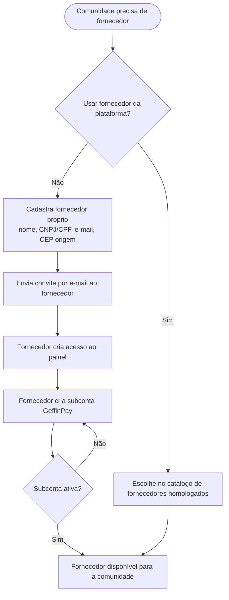

### 8.3 Cadastro de produto

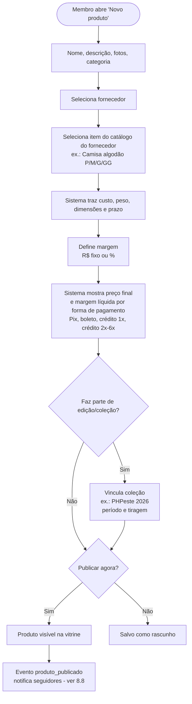

### 8.4 Jornada de compra


### 8.5 Atendimento do pedido pelo fornecedor


### 8.6 Cancelamento e estorno


### 8.7 Acompanhar uma comunidade

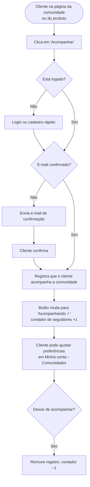

### 8.8 Notificação de lançamento para seguidores

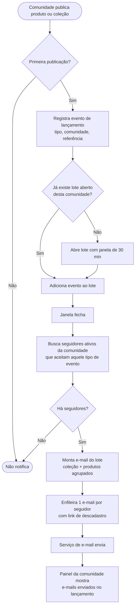

---

## 9. Diagramas de sequência

### 9.1 Cálculo de frete no carrinho

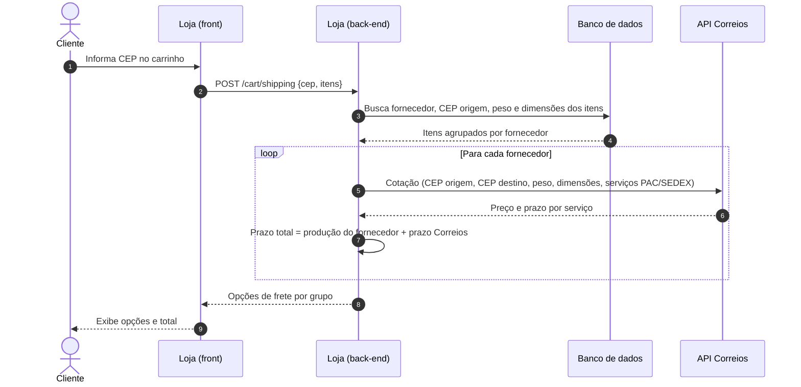

### 9.2 Checkout e pagamento com split

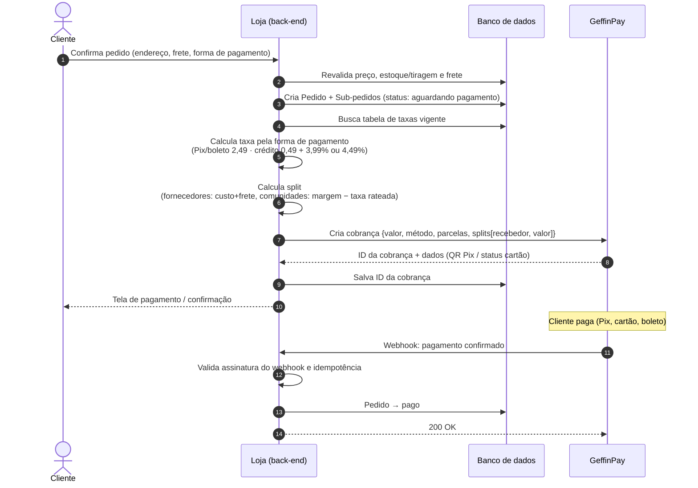

### 9.3 Notificação e atendimento pelo fornecedor


### 9.4 Acompanhamento de rastreio

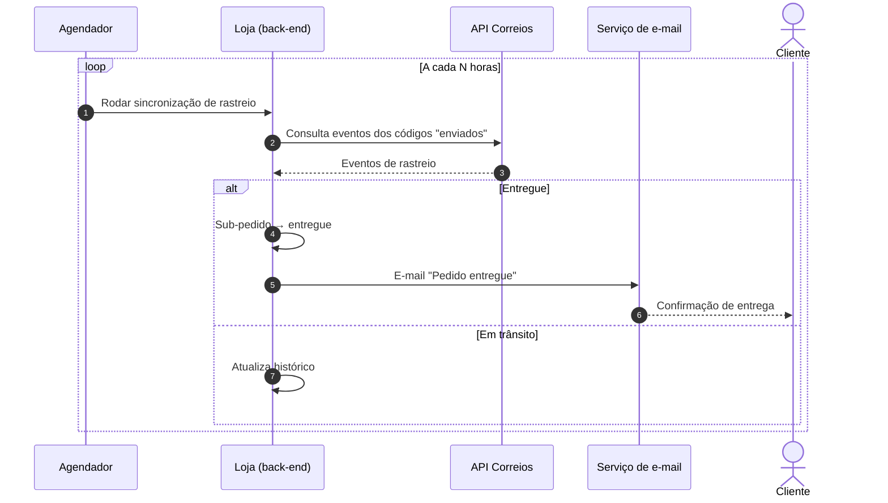

### 9.5 Estorno


### 9.6 Acompanhar comunidade

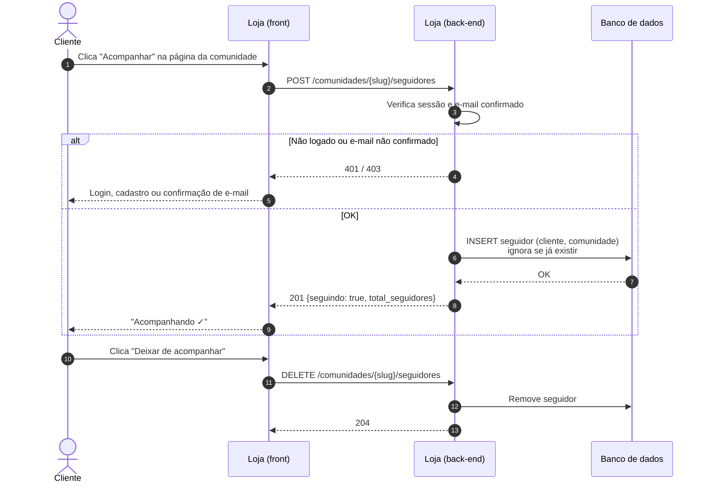

### 9.7 Lançamento e envio de e-mail para seguidores

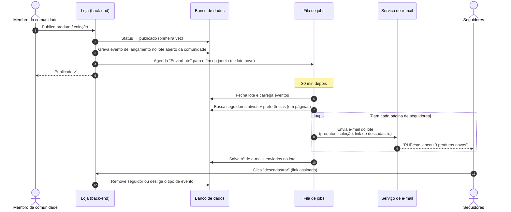

---

## 10. Ciclo de vida do pedido

Status aplicado a cada **sub-pedido** (um por fornecedor). O pedido geral mostra o status agregado.

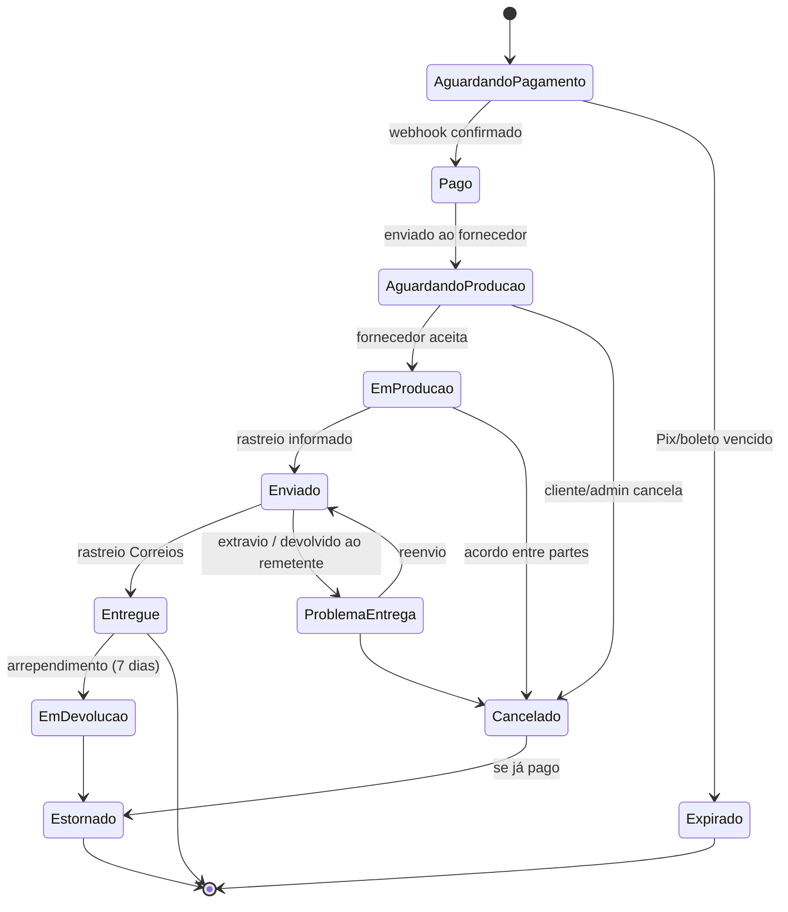

---

## 11. Modelo de dados (conceitual)

```mermaid
erDiagram
    USUARIO ||--o{ MEMBRO_COMUNIDADE : "participa"
    COMUNIDADE ||--o{ MEMBRO_COMUNIDADE : "tem"
    COMUNIDADE ||--o{ PRODUTO : "vende"
    COMUNIDADE ||--o{ COMUNIDADE_FORNECEDOR : "usa"
    FORNECEDOR ||--o{ COMUNIDADE_FORNECEDOR : "atende"
    FORNECEDOR ||--o{ ITEM_FORNECEDOR : "oferece"
    ITEM_FORNECEDOR ||--o{ VARIACAO_ITEM : "tem"
    PRODUTO }o--|| ITEM_FORNECEDOR : "baseado em"
    PRODUTO }o--o| COLECAO : "pertence a"
    COMUNIDADE ||--o{ COLECAO : "cria"
    CLIENTE ||--o{ PEDIDO : "faz"
    PEDIDO ||--|{ SUB_PEDIDO : "dividido em"
    SUB_PEDIDO }o--|| FORNECEDOR : "atendido por"
    SUB_PEDIDO ||--|{ ITEM_PEDIDO : "contém"
    ITEM_PEDIDO }o--|| PRODUTO : "de"
    PEDIDO ||--|| PAGAMENTO : "pago por"
    PAGAMENTO ||--|{ SPLIT : "dividido em"
    PAGAMENTO }o--|| TABELA_TAXA : "usa taxa vigente"
    CLIENTE ||--o{ SEGUIDOR : "acompanha"
    COMUNIDADE ||--o{ SEGUIDOR : "é acompanhada"
    COMUNIDADE ||--o{ LOTE_LANCAMENTO : "gera"
    LOTE_LANCAMENTO ||--|{ EVENTO_LANCAMENTO : "agrupa"
    COMUNIDADE }o--o{ TECNOLOGIA : "tem temas"

    COMUNIDADE {
        uuid id
        string nome
        string slug
        string regiao
        int total_seguidores
        string status "pendente|aprovada|suspensa"
        string geffinpay_recebedor_id
    }
    MEMBRO_COMUNIDADE {
        uuid usuario_id
        uuid comunidade_id
        string papel "dono|colaborador"
    }
    FORNECEDOR {
        uuid id
        string nome
        string documento
        string email
        string cep_origem
        string escopo "plataforma|proprio"
        uuid comunidade_dona_id "nulo se plataforma"
        string geffinpay_recebedor_id
    }
    ITEM_FORNECEDOR {
        uuid id
        string nome
        int prazo_producao_dias
    }
    VARIACAO_ITEM {
        uuid id
        string atributos "tamanho, cor"
        decimal custo
        int peso_g
        string dimensoes_cm
    }
    PRODUTO {
        uuid id
        string nome
        string tipo_margem "fixo|percentual"
        decimal margem
        string status "rascunho|publicado|revisao|arquivado"
    }
    COLECAO {
        uuid id
        string nome "PHPeste 2026"
        date inicio_venda
        date fim_venda
        int tiragem_max
    }
    PEDIDO {
        uuid id
        decimal total
        string status
    }
    SUB_PEDIDO {
        uuid id
        decimal frete
        string servico_frete "PAC|SEDEX"
        string codigo_rastreio
        string status
    }
    ITEM_PEDIDO {
        uuid id
        int quantidade
        decimal custo_unitario "snapshot"
        decimal margem_unitaria "snapshot"
    }
    PAGAMENTO {
        uuid id
        string geffinpay_cobranca_id
        string metodo "pix|boleto|credito"
        int parcelas "1 a 6"
        decimal taxa_fixa "snapshot"
        decimal taxa_percentual "snapshot"
        decimal taxa_total
        string status
    }
    TABELA_TAXA {
        uuid id
        string metodo "pix|boleto|credito_1x|credito_2a6x"
        decimal fixa "2,49 | 0,49"
        decimal percentual "0 | 3,99 | 4,49"
        date vigencia_inicio
        date vigencia_fim
    }
    SEGUIDOR {
        uuid cliente_id
        uuid comunidade_id
        string tipos_evento "lista; vazio = todos"
        datetime desde
    }
    EVENTO_LANCAMENTO {
        uuid id
        string tipo "produto_publicado|colecao_publicada|..."
        string referencia_id
        datetime criado_em
    }
    LOTE_LANCAMENTO {
        uuid id
        datetime fecha_em
        string status "aberto|enviado"
        int emails_enviados
    }
    TECNOLOGIA {
        uuid id
        string nome "PHP, Python, Dados..."
    }
    SPLIT {
        uuid id
        string recebedor_tipo "fornecedor|comunidade|gateway|plataforma"
        string recebedor_id
        decimal valor
    }
```

> **Importante:** custo e margem são gravados como *snapshot* no `ITEM_PEDIDO`. Mudanças futuras de preço não alteram pedidos já feitos nem o split deles.

---

## 12. Telas envolvidas

### 12.1 Inventário de telas

| # | Área | Tela | Ator | Principais elementos |
|---|---|---|---|---|
| L01 | Loja | Home | Cliente | Destaques, coleções ativas (ex.: PHPeste 2026), comunidades por tecnologia, lançamentos das comunidades acompanhadas, mais vendidos |
| L02 | Loja | Página da comunidade | Cliente | Logo, tecnologias, região, descrição, "para onde vai o dinheiro", **botão Acompanhar** + nº de seguidores, coleções, produtos |
| L03 | Loja | Listagem / busca | Cliente | Filtros por tecnologia, região, comunidade, categoria, coleção, preço |
| L03b | Loja | Diretório de comunidades | Cliente | Todas as comunidades, filtro por tecnologia e região, Acompanhar direto no card |
| L04 | Loja | Página de coleção/edição | Cliente | Banner do evento, contagem regressiva, tiragem restante |
| L05 | Loja | Detalhe do produto | Cliente | Fotos, variações, preço, simulador de frete, prazo, "quanto vai para a comunidade", Acompanhar comunidade |
| L06 | Loja | Carrinho | Cliente | Itens agrupados por envio, CEP, escolha de frete por grupo |
| L07 | Loja | Checkout — identificação/endereço | Cliente | Login/cadastro rápido, endereço (autocompletar via CEP) |
| L08 | Loja | Checkout — pagamento | Cliente | Pix, boleto, crédito 1x a 6x sem juros (filtrado pela RN22); quanto as comunidades recebem em cada opção; resumo |
| L09 | Loja | Confirmação | Cliente | Número do pedido, QR Pix, próximos passos |
| L10 | Loja | Minha conta — pedidos | Cliente | Lista, status por envio, rastreio, cancelar/devolver |
| L11 | Loja | Minha conta — comunidades acompanhadas | Cliente | Lista de comunidades, tipos de lançamento por comunidade, deixar de acompanhar, pausar todos os e-mails |
| L12 | Loja | Descadastro (página do link do e-mail) | Cliente | Confirmação sem login: deixar esta comunidade ou todos os lançamentos |
| C01 | Painel Comunidade | Onboarding / cadastro | Membro | Dados da comunidade, status de aprovação, subconta GeffinPay |
| C02 | Painel Comunidade | Dashboard | Membro | Vendas do período, pedidos pendentes, **nº de seguidores**, alertas (custo alterado, atraso, margem baixa) |
| C03 | Painel Comunidade | Produtos (lista) | Membro | Status, preço, margem, fornecedor |
| C04 | Painel Comunidade | Produto (form) | Membro | Dados, fornecedor, variações, margem, margem líquida por forma de pagamento, aviso de que publicar notifica os seguidores |
| C05 | Painel Comunidade | Coleções / edições | Membro | Período, tiragem, produtos vinculados, publicar coleção (notifica seguidores) |
| C05b | Painel Comunidade | Lançamentos | Membro | Histórico de lotes de lançamento, e-mails enviados por lote |
| C06 | Painel Comunidade | Fornecedores | Membro | Da plataforma (catálogo) e próprios; convidar fornecedor |
| C07 | Painel Comunidade | Pedidos | Membro | Pedidos com itens da comunidade, status, rastreio |
| C08 | Painel Comunidade | Financeiro | Dono | Recebido, a receber, estornos, extrato por pedido com forma de pagamento e taxa |
| C09 | Painel Comunidade | Membros | Dono | Convidar, papéis, remover |
| C10 | Painel Comunidade | Configurações | Dono | Perfil público, tecnologias e região, dados bancários (GeffinPay), política de troca |
| F01 | Painel Fornecedor | Onboarding | Fornecedor | Aceitar convite, dados, CEP origem, subconta GeffinPay |
| F02 | Painel Fornecedor | Dashboard | Fornecedor | Novos pedidos, em produção, atrasados |
| F03 | Painel Fornecedor | Catálogo de itens | Fornecedor | Itens, variações, custo, peso/dimensões, prazo de produção |
| F04 | Painel Fornecedor | Pedidos (lista) | Fornecedor | Filtro por status, comunidade, prazo |
| F05 | Painel Fornecedor | Pedido (detalhe) | Fornecedor | Itens com arte/estampa, endereço, etiqueta, informar rastreio |
| F06 | Painel Fornecedor | Financeiro | Fornecedor | Recebido, a receber, por comunidade |
| A01 | Admin | Dashboard | Admin | GMV, pedidos, comunidades ativas, alertas |
| A02 | Admin | Comunidades | Admin | Aprovar, suspender |
| A03 | Admin | Fornecedores da plataforma | Admin | Homologar, suspender |
| A04 | Admin | Pedidos e disputas | Admin | Busca global, mediação, estornos |
| A05 | Admin | Configurações | Admin | **Tabela de taxas GeffinPay com vigência**, janela de agrupamento de lançamentos, prazos (RN17), integrações |
| A06 | Admin | Tecnologias | Admin | Cadastro de tecnologias/temas usados nos filtros |
| E01 | E-mail | Pedido confirmado | Cliente | |
| E02 | E-mail | Novo pedido | Fornecedor | |
| E03 | E-mail | Pedido enviado (rastreio) | Cliente | |
| E04 | E-mail | Pedido entregue | Cliente | |
| E05 | E-mail | Estorno | Cliente, Comunidade, Fornecedor | |
| E06 | E-mail | Convite | Membro, Fornecedor | |
| E07 | E-mail | Alerta de atraso | Comunidade, Admin | |
| E08 | E-mail | Lançamento da comunidade (produto e/ou coleção, agrupado) | Seguidor | |
| E09 | E-mail | Confirmação de e-mail (necessário para acompanhar) | Cliente | |

### 12.2 Wireframes de baixa fidelidade

**L01 — Home**
```
┌────────────────────────────────────────────────────────────┐
│ 🛍 Loja das Comunidades Tech BR  [buscar...]    👤  🛒(2)  │
├────────────────────────────────────────────────────────────┤
│  ╔══════════════════════════════════════════════════════╗  │
│  ║  PHPeste 2026 — itens exclusivos da edição           ║  │
│  ║  Vendas até 30/11 · tiragem limitada   [Ver coleção] ║  │
│  ╚══════════════════════════════════════════════════════╝  │
│                                                            │
│  Tecnologias                                               │
│  [PHP] [Python] [JS] [Java] [Go] [Dados] [DevOps] [+]      │
│                                                            │
│  Novidades das comunidades que você acompanha              │
│  ┌────────┐ ┌────────┐ ┌────────┐                          │
│  │ [img]  │ │ [img]  │ │ [img]  │                          │
│  │Caneca  │ │Mascote │ │Camisa  │                          │
│  │PHP BR  │ │PHP-SP  │ │PHPeste │                          │
│  │R$ 45   │ │R$ 120  │ │R$ 70   │                          │
│  └────────┘ └────────┘ └────────┘                          │
│                                                            │
│  Comunidades em destaque                    [ver todas →]  │
│  (PHP BR ✓) (PHPeste ✓) (Python X) (JS Y) (Dados Z)        │
└────────────────────────────────────────────────────────────┘
```

**L02 — Página da comunidade**
```
┌────────────────────────────────────────────────────────────┐
│ ← Comunidades                                              │
│ [logo]  Comunidade PHPeste                                 │
│         PHP · Nordeste         👥 1.284 seguidores         │
│                                  [ ＋ Acompanhar ]         │
│                                                            │
│  Evento de PHP do Nordeste. O dinheiro da loja financia    │
│  o PHPeste, bolsas de ingresso e meetups na região.        │
│  💚 R$ 12.430 arrecadados em 2026                          │
│                                                            │
│  Coleções                                                  │
│  [PHPeste 2026 — até 30/11]  [PHPeste 2025 — encerrada]    │
│                                                            │
│  Produtos                                                  │
│  ┌────────┐ ┌────────┐ ┌────────┐ ┌────────┐               │
│  │Camisa  │ │Caneca  │ │elePHP- │ │Ecobag  │               │
│  │R$ 70   │ │R$ 45   │ │ant 120 │ │R$ 35   │               │
│  └────────┘ └────────┘ └────────┘ └────────┘               │
└────────────────────────────────────────────────────────────┘
  Depois de clicar:  [ ✓ Acompanhando ▾ ]
                       ├ Preferências de e-mail
                       └ Deixar de acompanhar
```

**L05 — Detalhe do produto**
```
┌────────────────────────────────────────────────────────────┐
│ ← PHPeste / Camisas                                        │
│ ┌──────────────────┐  Camisa Oficial PHPeste 2026          │
│ │                  │  por Comunidade PHPeste [＋Acompanhar] │
│ │      [foto]      │                                       │
│ │                  │  R$ 70,00                             │
│ └──────────────────┘  💚 até R$ 22,51 apoiam a comunidade  │
│ [▫][▫][▫]                                                  │
│                       Tamanho: (P) (M) (G) (GG)            │
│                       Qtd: [- 1 +]                         │
│                                                            │
│                       Calcular frete: [00000-000] [OK]     │
│                        PAC   R$ 22,00 · até 12 dias úteis  │
│                        SEDEX R$ 38,00 · até 8 dias úteis   │
│                        (inclui 5 dias de produção)         │
│                                                            │
│                       [   Adicionar ao carrinho   ]        │
│  Edição limitada: restam 47 de 200                         │
└────────────────────────────────────────────────────────────┘
```

**L06 — Carrinho (agrupado por envio)**
```
┌────────────────────────────────────────────────────────────┐
│ Seu carrinho                          CEP: [50000-000] [OK]│
├────────────────────────────────────────────────────────────┤
│ 📦 Envio 1 — sai de Recife/PE                              │
│   Camisa PHPeste 2026 (M) x1 ............... R$  70,00     │
│   Camisa PHP-SP (G) x1 ..................... R$  65,00     │
│   Frete: (•) PAC R$ 24,00 12d  ( ) SEDEX R$ 41,00 7d       │
├────────────────────────────────────────────────────────────┤
│ 📦 Envio 2 — sai de São Paulo/SP                           │
│   elePHPant PHPeste x1 ..................... R$ 120,00     │
│   Frete: (•) PAC R$ 28,00 15d  ( ) SEDEX R$ 52,00 9d       │
├────────────────────────────────────────────────────────────┤
│ Subtotal R$ 255,00 · Frete R$ 52,00 · Total R$ 307,00      │
│ 💚 R$ 85,00 vão para as comunidades                        │
│                                  [ Finalizar compra → ]    │
└────────────────────────────────────────────────────────────┘
```

**L08 — Checkout: pagamento**
```
┌────────────────────────────────────────────────────────────┐
│ Pagamento                                Total R$ 307,00   │
├────────────────────────────────────────────────────────────┤
│ (•) Pix                                                    │
│     💚 comunidades recebem R$ 82,51                        │
│ ( ) Boleto (compensa em até 3 dias úteis)                  │
│     💚 comunidades recebem R$ 82,51                        │
│ ( ) Cartão de crédito  [1x de R$ 307,00 sem juros ▾]       │
│     até 6x de R$ 51,17 sem juros                           │
│     💚 comunidades recebem R$ 72,26 (1x) / R$ 70,73 (2–6x) │
│                                                            │
│ 💡 No Pix, as comunidades recebem R$ 10,25 a mais          │
│                                   [ Pagar R$ 307,00 → ]    │
└────────────────────────────────────────────────────────────┘
```

**L11 — Minha conta: comunidades acompanhadas**
```
┌────────────────────────────────────────────────────────────┐
│ Minha conta › Comunidades que acompanho                    │
├────────────────────────────────────────────────────────────┤
│ [ ] Pausar todos os e-mails de lançamento                  │
│                                                            │
│ PHPeste          ☑ Produtos  ☑ Coleções   [Deixar]         │
│ PHP Brasil       ☑ Produtos  ☐ Coleções   [Deixar]         │
│ Python X         ☑ Produtos  ☑ Coleções   [Deixar]         │
│                                                            │
│ [+ Descobrir comunidades]                                  │
└────────────────────────────────────────────────────────────┘
```

**E08 — E-mail de lançamento (lote agrupado)**
```
┌────────────────────────────────────────────────────────────┐
│ De: Loja das Comunidades Tech BR                           │
│ Assunto: PHPeste lançou a coleção PHPeste 2026 🎉          │
├────────────────────────────────────────────────────────────┤
│ Oi, Fulana! A comunidade PHPeste, que você acompanha,      │
│ acabou de lançar:                                          │
│                                                            │
│ ╔ Coleção PHPeste 2026 · vendas até 30/11 · 200 unid. ╗    │
│ [img] Camisa Oficial ........ R$ 70   [Ver produto]        │
│ [img] Caneca ................ R$ 45   [Ver produto]        │
│ [img] elePHPant PHPeste ..... R$ 120  [Ver produto]        │
│                                                            │
│            [ Ver coleção completa → ]                      │
│                                                            │
│ Você recebe este e-mail porque acompanha PHPeste.          │
│ Deixar de acompanhar PHPeste · Parar todos os lançamentos  │
│ Preferências de e-mail                                     │
└────────────────────────────────────────────────────────────┘
```

**C04 — Formulário de produto (painel da comunidade)**
```
┌────────────────────────────────────────────────────────────┐
│ PHPeste ▾ │ Produtos › Novo produto                        │
├───────────┼────────────────────────────────────────────────┤
│ Dashboard │ Nome: [Camisa Oficial PHPeste 2026        ]    │
│ Produtos  │ Fotos: [+ upload]                              │
│ Coleções  │ Fornecedor: [Gráfica X (plataforma)      ▾]    │
│ Fornecedor│ Item base:  [Camisa algodão 30.1         ▾]    │
│ Pedidos   │                                                │
│ Financeiro│ Variação │ Custo  │ Margem   │ Preço final     │
│ Membros   │ P        │ 45,00  │ [25,00]  │ 70,00           │
│ Config.   │ M        │ 45,00  │ [25,00]  │ 70,00           │
│           │ GG       │ 49,00  │ [25,00]  │ 74,00           │
│           │                                                │
│           │ Margem: (•) R$ fixo  ( ) %                     │
│           │ Coleção: [PHPeste 2026 ▾]  Tiragem: [200]      │
│           │                                                │
│           │ Margem líquida (camisa M, sem frete):          │
│           │  Pix ............ taxa 2,49 → R$ 22,51         │
│           │  Boleto ......... taxa 2,49 → R$ 22,51         │
│           │  Crédito 1x ..... taxa 3,28 → R$ 21,72         │
│           │  Crédito 2x–6x .. taxa 3,63 → R$ 21,37         │
│           │  ⚠ No crédito, o frete também entra na taxa %  │
│           │                                                │
│           │ 🔔 Publicar avisa 1.284 seguidores por e-mail  │
│           │ [Salvar rascunho]  [Publicar]                  │
└───────────┴────────────────────────────────────────────────┘
```

**C08 — Financeiro da comunidade**
```
┌────────────────────────────────────────────────────────────┐
│ PHPeste ▾ │ Financeiro                   Período: [Set/26▾]│
├───────────┼────────────────────────────────────────────────┤
│           │ ┌──────────┐ ┌──────────┐ ┌──────────┐         │
│           │ │Recebido  │ │A receber │ │Estornos  │         │
│           │ │R$ 3.420  │ │R$ 1.180  │ │R$ 70     │         │
│           │ └──────────┘ └──────────┘ └──────────┘         │
│           │                                                │
│           │ Pedido│Forma  │Bruto │Taxa  │Líquido│ St     │
│           │ #1001 │Créd 1x│ 25,00│ 4,16 │ 20,84 │ ✅     │
│           │ #1002 │Pix    │ 50,00│ 2,49 │ 47,51 │ ✅     │
│           │ #1003 │Créd 3x│ 65,00│10,91 │ 54,09 │ ⏳     │
│           │ ...                                            │
│           │ Taxa = parte da comunidade na taxa do pedido   │
│           │                              [Exportar CSV]    │
└───────────┴────────────────────────────────────────────────┘
```

**F05 — Detalhe do pedido (painel do fornecedor)**
```
┌────────────────────────────────────────────────────────────┐
│ Gráfica X │ Pedidos › #1001-A        Status: Em produção   │
├───────────┼────────────────────────────────────────────────┤
│           │ Prazo para postagem: 27/09 (faltam 3 dias)     │
│           │                                                │
│           │ Itens                                          │
│           │  Camisa PHPeste 2026 · M · x1  [baixar arte]   │
│           │  Camisa PHP-SP · G · x1        [baixar arte]   │
│           │                                                │
│           │ Entregar para                                  │
│           │  Fulana de Tal · Rua X, 123 · Recife/PE        │
│           │  CEP 50000-000                                 │
│           │  Serviço: PAC                                  │
│           │                                                │
│           │ Você recebe: R$ 134,00 (custo 110 + frete 24)  │
│           │                                                │
│           │ Código de rastreio: [____________] [Enviar]    │
└───────────┴────────────────────────────────────────────────┘
```

---

## 13. Mapa de navegação

```mermaid
flowchart LR
    subgraph Loja pública
        L01[Home] --> L02[Comunidade]
        L01 --> L03b[Diretório de comunidades] --> L02
        L02 -.Acompanhar.-> L11[Minha conta: comunidades acompanhadas]
        E08[/E-mail de lançamento/] --> L05
        E08 --> L04
        E08 -.descadastro.-> L12[Descadastro]
        L01 --> L03[Busca/Listagem]
        L01 --> L04[Coleção/Edição]
        L02 --> L05[Produto]
        L03 --> L05
        L04 --> L05
        L05 --> L06[Carrinho]
        L06 --> L07[Checkout: endereço]
        L07 --> L08[Checkout: pagamento]
        L08 --> L09[Confirmação]
        L09 --> L10[Minha conta: pedidos]
    end

    subgraph Painel Comunidade
        C02[Dashboard] --> C03[Produtos] --> C04[Form produto]
        C02 --> C05[Coleções]
        C02 --> C05b[Lançamentos]
        C02 --> C06[Fornecedores]
        C02 --> C07[Pedidos]
        C02 --> C08[Financeiro]
        C02 --> C09[Membros]
        C02 --> C10[Config]
    end

    subgraph Painel Fornecedor
        F02[Dashboard] --> F03[Catálogo]
        F02 --> F04[Pedidos] --> F05[Detalhe pedido]
        F02 --> F06[Financeiro]
    end

    subgraph Admin
        A01[Dashboard] --> A02[Comunidades]
        A01 --> A03[Fornecedores]
        A01 --> A04[Pedidos/Disputas]
        A01 --> A05[Config / Taxas]
        A01 --> A06[Tecnologias]
    end
```

---

## 14. Riscos e pontos em aberto

| # | Tema | Pergunta / risco | Sugestão inicial |
|---|---|---|---|
| Q1 | **Taxa do gateway** | Proposta: comunidades absorvem, rateado pela margem (RN20). A comunidade aceita pagar a taxa % do cartão sobre o frete? Ou repassar ao cliente um acréscimo no parcelado? | Validar com comunidades piloto; alternativa é oferecer parcelado só acima de um valor mínimo |
| Q2 | **Sustentabilidade da plataforma** | Quem paga hospedagem e manutenção? | Taxa pequena (ex.: 1–3%) ou apoio/patrocínio; decidir com a comunidade |
| Q3 | **GeffinPay** | Suporta split com N recebedores, estorno parcial com reversão de split, subcontas para PF e parcelamento sem juros com taxa de 4,49% para 2x–6x? Estorno devolve a taxa? Prazo de recebimento (D+?) por forma de pagamento? | Validar a API antes de fechar a arquitetura |
| Q4 | **API dos Correios** | A API oficial (CWS) exige contrato; cada fornecedor tem o seu? | Cotação com contrato da plataforma ou dos fornecedores; avaliar agregadores (Melhor Envio etc.) como alternativa |
| Q5 | **Responsabilidade legal** | Quem emite nota fiscal? Comunidades sem CNPJ podem vender? | Fornecedor emite NF da venda do produto; comunidade recebe a margem como intermediação/doação. **Validar com contador** |
| Q6 | **Chargeback** | Quem arca com contestação de cartão? | Definir regra no termo de uso; possível reserva/retensão da comunidade |
| Q7 | **Atraso/extravio** | Fornecedor não envia ou produto se perde | Prazo RN17, alerta, reenvio pelo fornecedor, mediação do admin |
| Q8 | **Qualidade** | Produto ruim afeta a imagem da comunidade | Homologação de fornecedores da plataforma + avaliações de clientes |
| Q9 | **Direitos de marca** | Uso de marcas de linguagens/projetos (PHP, Python, mascotes etc.) e logos | Cada comunidade responde pelas próprias artes; verificar diretrizes de uso das marcas |
| Q10 | **LGPD** | Fornecedor recebe dados pessoais do cliente (endereço) | Termo de uso + compartilhar só o necessário para entrega |
| Q11 | **Frete com vários itens** | Somar pesos/dimensões pode dar cotação errada | Fornecedor cadastra embalagens padrão; revisar regra de cubagem |
| Q12 | **Quem é comunidade?** | Com o escopo aberto a qualquer stack, como evitar empresas ou perfis se passando por comunidade? | Critérios da RN01, aprovação manual e selo "comunidade verificada" |
| Q13 | **Custo e reputação de e-mail** | Comunidades grandes = milhares de e-mails por lançamento; risco de cair em spam | Agrupamento (RN28), descadastro 1 clique, domínio com SPF/DKIM/DMARC, provedor transacional; acompanhar custo por mil envios |
| Q14 | **Abuso de lançamentos** | Comunidade publica e despublica para "reenviar" e-mail | RN27 (só a primeira publicação notifica) + limite de lotes por dia por comunidade |
| Q15 | **Pedido com taxa maior que a margem** | Pedido barato com frete caro no cartão | RN22 esconde a opção; avaliar margem mínima por produto |

---

## 15. Roadmap sugerido

```mermaid
flowchart LR
    M0[Fase 0<br/>Validação] --> M1[Fase 1<br/>MVP]
    M1 --> M2[Fase 2<br/>Escala]
    M2 --> M3[Fase 3<br/>Extras]
```

| Fase | Escopo |
|---|---|
| **0 — Validação** | Apresentar este documento às comunidades; responder Q1–Q5 e Q12; conversar com 2–3 fornecedores e 3–5 comunidades piloto, incluindo ao menos uma fora do PHP (ex.: PHPeste, PHP BR + uma de outra stack) |
| **1 — MVP** | Loja (L01–L10), painel comunidade básico (produtos, pedidos, financeiro), painel fornecedor (pedidos + rastreio), split GeffinPay com as 4 formas de pagamento e tabela de taxas, frete Correios, e-mails E01–E03. **Acompanhar comunidade simples** (seguir/deixar, e-mail E08 agrupado, descadastro). Fornecedores cadastrados manualmente pelo admin |
| **2 — Escala** | Autoatendimento de comunidades e fornecedores, múltiplos membros e papéis, diretório por tecnologia/região, coleções/edições com tiragem, estorno pelo painel, rastreio automático, preferências por tipo de lançamento (L11), histórico de lançamentos (C05b) |
| **3 — Extras** | Avaliações, cupons, pré-venda de edições, kits (camisa + caneca + mascote), novos eventos de lançamento (pré-venda, reposição, evento anunciado), relatório público de transparência por comunidade |

---

*Contribuições, críticas e ideias são bem-vindas. Abra uma discussão ou fale com os mantenedores.* 💙
